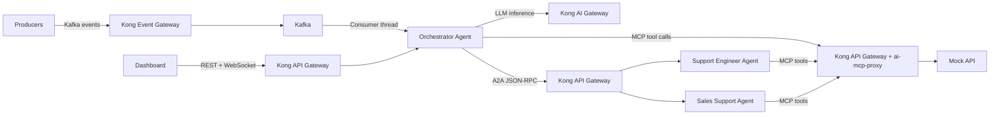
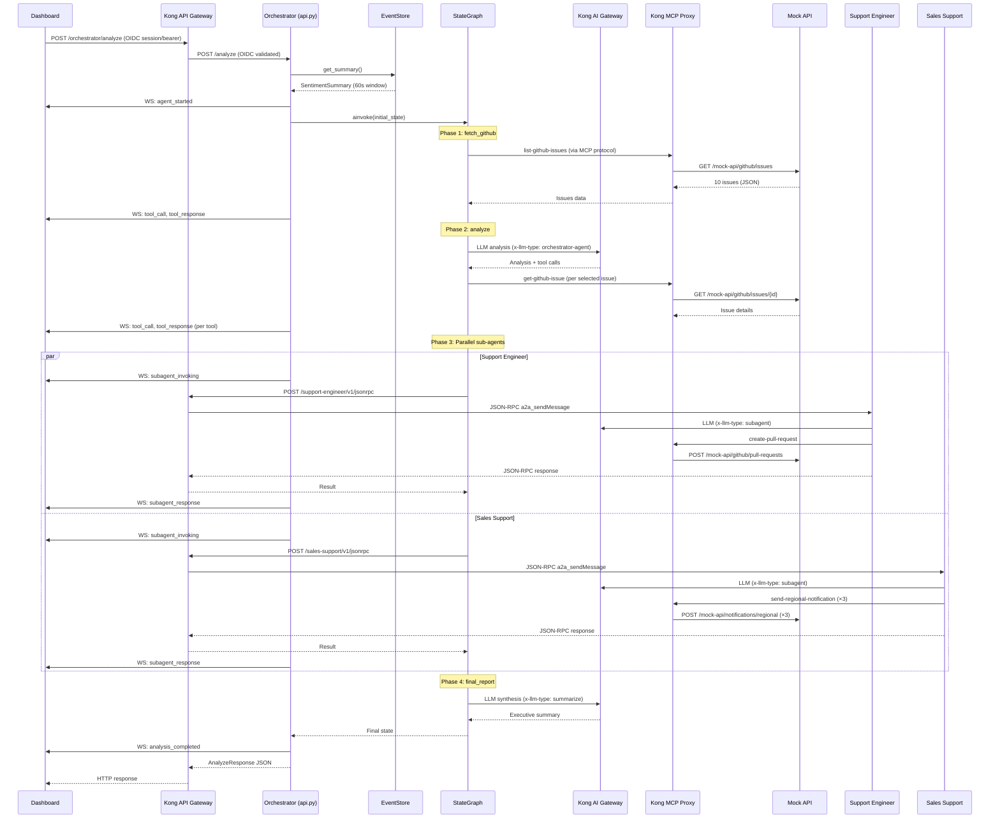
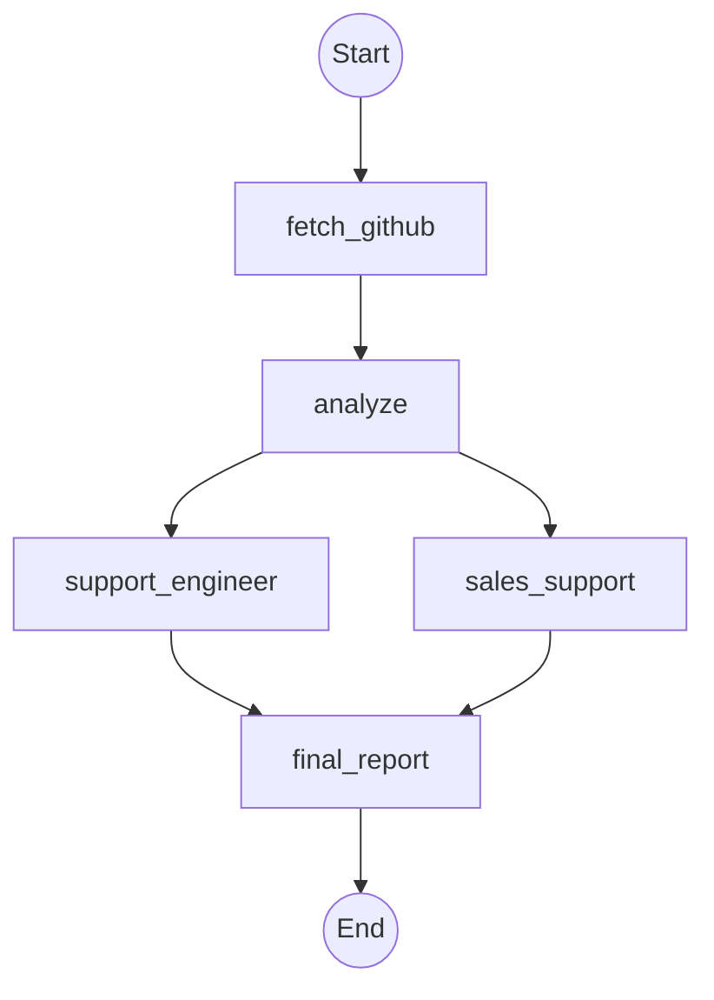
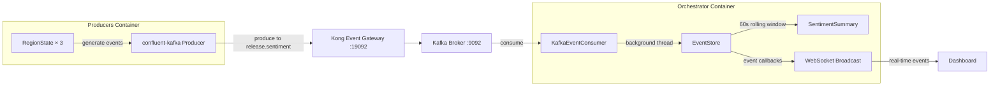
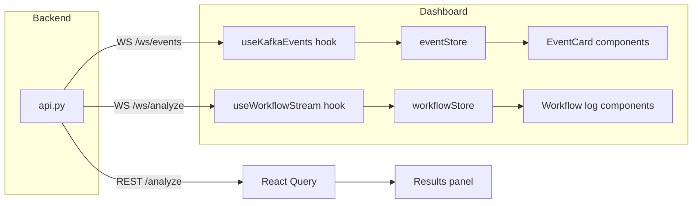
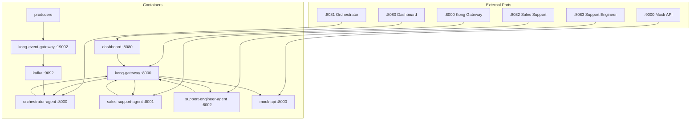

# Architecture Guide

> **Keep this up to date.** If you make changes that alter the architecture — adding components, changing data flows, modifying the agent graph, or restructuring the Kong configuration — update this document as part of the same change.

This document is a deep walkthrough of how the codebase works. It's meant to help you orient yourself quickly and understand how all the pieces fit together, so you know exactly where to go when you want to make a change.

For setup instructions and how to run the demo, see the [README](README.md).

## Table of Contents

- [System Overview](#system-overview)
- [Kong's Role in the Architecture](#kongs-role-in-the-architecture)
- [Key Technologies](#key-technologies)
- [Component Deep Dive](#component-deep-dive)
  - [Producers](#producers)
  - [Kafka Consumer & EventStore](#kafka-consumer--eventstore)
  - [Orchestrator Agent](#orchestrator-agent)
  - [Sub-Agents](#sub-agents)
  - [Mock API](#mock-api)
  - [Dashboard](#dashboard)
- [End-to-End Analysis Walkthrough](#end-to-end-analysis-walkthrough)
- [Agent Orchestration in Detail](#agent-orchestration-in-detail)
  - [StateGraph Structure](#stategraph-structure)
  - [Phase 1: fetch_github](#phase-1-fetch_github)
  - [Phase 2: analyze](#phase-2-analyze)
  - [Phase 3: support_engineer + sales_support (Parallel)](#phase-3-support_engineer--sales_support-parallel)
  - [Phase 4: final_report](#phase-4-final_report)
- [A2A Protocol Implementation](#a2a-protocol-implementation)
  - [Agent Discovery](#agent-discovery)
  - [JSON-RPC Communication](#json-rpc-communication)
  - [Sub-Agent Response Contract](#sub-agent-response-contract)
- [MCP Tool Access & ACLs](#mcp-tool-access--acls)
- [Kong Gateway Configuration](#kong-gateway-configuration)
  - [AI Gateway: Model Pools & Failover](#ai-gateway-model-pools--failover)
  - [MCP Proxy Plugin](#mcp-proxy-plugin)
  - [Consumers, Consumer Groups & ACLs](#consumers-consumer-groups--acls)
- [Events Pipeline: Producers to EventStore](#events-pipeline-producers-to-eventstore)
- [Dashboard Architecture](#dashboard-architecture)
  - [Application Structure](#application-structure)
  - [Real-Time Data Flow](#real-time-data-flow)
  - [Zustand Stores](#zustand-stores)
  - [WebSocket Hooks](#websocket-hooks)
- [Docker Compose Topology](#docker-compose-topology)
  - [Container Map](#container-map)
  - [Startup Order & Health Checks](#startup-order--health-checks)
  - [Networking](#networking)
- [Error Handling & Reliability](#error-handling--reliability)
  - [Tool Error Middleware](#tool-error-middleware)
  - [Sub-Agent Failure Handling](#sub-agent-failure-handling)
  - [Final Report Error Transparency](#final-report-error-transparency)

---

## System Overview

The system is a multi-agent sentiment analysis pipeline. Producers generate fake social media posts about a fictional product release. Those events flow through Kong Event Gateway into Kafka, where the orchestrator agent consumes them. When a user clicks "Analyze" on the dashboard (or hits the API), the orchestrator runs a LangGraph StateGraph that fetches GitHub issues via MCP tools, analyzes sentiment with an LLM, delegates to two sub-agents in parallel via A2A over Kong Gateway, and synthesizes a final executive report. The dashboard shows all of this in real time via WebSockets.



---

## Kong's Role in the Architecture

Kong sits at every network hop. This is the core demo point — you never need to explain Kong's role in isolation because it's naturally part of every interaction:

- **Event ingestion**: Kong Event Gateway fronts Kafka, routing events from producers to the broker.
- **LLM inference**: Kong AI Gateway routes `/ai/chat` requests to different model pools based on the `x-llm-type` header. Each pool has priority-based failover across providers (Azure OpenAI, AWS Bedrock, Google Gemini).
- **MCP tool access**: The `ai-mcp-proxy` plugin on Kong API Gateway converts REST endpoints on the Mock API into MCP-protocol tools. ACLs on consumer groups control which agent can access which tools.
- **Agent-to-agent communication**: A2A JSON-RPC calls from the orchestrator to sub-agents route through Kong API Gateway, getting key-auth and observability.
- **Dashboard access**: The dashboard authenticates via OIDC PKCE login on the `dashboard-ui-route`, which establishes a session cookie. All subsequent API calls to `/orchestrator/*` use this session cookie, validated by the OIDC plugin on the `Orchestrator_Agent_Route` (which also provides CORS and rate limiting).

All of this is declared in a single file: `kong/api-gateway/base-config.yaml`.

---

## Key Technologies

This project uses a wide variety of libraries and frameworks. You don't need to understand all of them to work on the codebase, but having context on the core ones — especially how they relate to each other — will save you time.

### LangChain vs LangGraph

These two are related but serve different purposes, and both are used in this project:

**LangChain** is a framework for building LLM-powered applications. It provides abstractions for talking to LLMs, managing prompts, and connecting LLMs to tools. In this project, LangChain handles the low-level agent loops — `langchain.agents.create_agent()` creates a ReAct-style agent that can reason about which tools to call and iterate until it has an answer. The sub-agents (Support Engineer, Sales Support) are pure LangChain agents: they receive a prompt, reason about what tools to call, execute them, and return a result.

**LangGraph** is a separate library (built on top of LangChain) for orchestrating multi-step workflows as directed graphs. Where LangChain manages a single agent's tool loop, LangGraph manages the *flow between multiple agents and processing steps*. It provides `StateGraph`, which lets you define nodes (processing steps) and edges (transitions), including parallel execution and conditional branching.

**How they work together in this project:** The orchestrator uses LangGraph's `StateGraph` to define the high-level pipeline (fetch issues → analyze → call sub-agents in parallel → write report). Each *node* in that graph may internally use a LangChain agent (e.g., the `analyze` node creates a LangChain agent with tools). So LangGraph is the outer orchestration layer, and LangChain is the inner agent execution layer.

**Why both?** You could build this with just LangChain, but you'd lose the deterministic execution guarantees. With LangGraph, the sub-agents are graph nodes that *always* execute — the LLM can't decide to skip them. This is critical for demo reliability.

### MCP (Model Context Protocol)

MCP is a standardized protocol for giving LLMs access to tools. Instead of each LLM framework inventing its own tool-calling interface, MCP defines a common protocol (similar to how LSP standardized editor-to-language-server communication).

In this project, Kong's `ai-mcp-proxy` plugin acts as an MCP server. It takes REST API endpoints (the Mock API) and exposes them as MCP tools. The agents connect as MCP clients using `langchain-mcp-adapters`, which bridges LangChain's tool interface with the MCP protocol. When an agent calls `get_tools()`, it gets back LangChain-compatible tool objects that internally make MCP protocol calls to Kong, which forwards them as REST requests to the Mock API.

### langchain-mcp-adapters

The bridge between LangChain and MCP. The `MultiServerMCPClient` class connects to one or more MCP servers and converts the discovered tools into LangChain tool objects that agents can use directly.

**Version pin:** This project pins `v0.1.14` because `v0.2.x` introduced a [breaking change](https://github.com/langchain-ai/langchain-mcp-adapters/issues/397) — the `_convert_call_tool_result` function started adding an `id` field to tool result content blocks (e.g., `{'type': 'text', 'text': '...', 'id': 'lc_...'}`). Anthropic's Messages API rejects this as "extra inputs are not permitted," causing 400 errors whenever a tool result is passed back to the LLM. Since this project routes through Kong AI Gateway to Anthropic models (Bedrock Claude), this breaks the sub-agent tool loops. Don't upgrade without verifying the issue is resolved upstream.

### FastAPI

FastAPI is the web framework for all Python services (orchestrator, sub-agents, mock API). It's async-native, which matters because the orchestrator needs to handle WebSocket connections, Kafka consumption, and LLM calls concurrently. FastAPI also generates OpenAPI schemas automatically from Pydantic models, which is convenient for the mock API's structured request/response validation.

### httpx

An async HTTP client for Python — think of it as an async-native alternative to `requests`. The orchestrator uses `httpx.AsyncClient` for A2A calls to sub-agents because `requests` is synchronous and would block the event loop. The shared client instance enables connection pooling across multiple A2A calls.

### confluent-kafka

The Python Kafka client from Confluent. Chosen over `kafka-python` because it wraps the high-performance `librdkafka` C library and is the most production-grade Python Kafka client. In this project, the producer uses it to publish events, and the orchestrator's `KafkaEventConsumer` uses it to consume them in a background thread.

### Zustand

A lightweight state management library for React. Unlike Redux, Zustand doesn't require boilerplate (no action creators, reducers, or providers). You define a store as a single function that returns state and actions, then use it as a hook anywhere in the component tree.

This project uses three Zustand stores: `eventStore` (Kafka events for display), `workflowStore` (analysis progress tracking), and `dashboardStore` (UI preferences). Zustand was chosen because the state management needs are straightforward — mostly appending events to lists and toggling flags — and Zustand lets you do that with minimal code. It also supports direct mutation-style updates via `set()`, which keeps the store definitions readable.

### React Query (TanStack Query)

Handles server-state data fetching — API calls with automatic caching, refetching, and loading/error states. In this project, React Query manages the REST API calls (health checks, triggering analysis, fetching results), while WebSocket data flows through Zustand stores instead. This separation keeps each tool doing what it's best at: React Query for request/response patterns, Zustand for streaming event state.

### shadcn/ui

Not a traditional component library — shadcn/ui takes a "copy into your project" approach. Instead of installing components as npm dependencies, you copy the source code directly into your `components/ui/` directory. This means you own the code and can customize it freely without fighting library abstractions.

The project uses shadcn/ui components (buttons, cards, tooltips, toasts, etc.) built on top of Radix UI primitives for accessibility. Styling is done via Tailwind CSS utility classes.

### decK

Kong's declarative configuration CLI. Instead of configuring Kong Gateway through its Admin API, you define the entire configuration in a YAML file (`base-config.yaml`) and sync it with `deck gateway sync`. This is similar to Terraform's approach — the file is the source of truth, and decK figures out what needs to change.

The file supports environment variable substitution (`${{ env "VAR_NAME" }}`), which is how API keys and control plane names are injected at sync time without being committed to the repo.

---

## Component Deep Dive

### Producers

**Directory:** `producers/`  
**Key files:** `producer.py`, `config.py`  
**Runtime:** Standalone Python container, no web server

The producer generates realistic social media sentiment events and publishes them to the `release.sentiment` Kafka topic every 3 seconds.

**How it works:**
- Each of the three regions (AMER, EMEA, APAC) has its own `RegionState` that tracks an independent sentiment trend (crisis, frustrated, mixed, positive).
- Trends change every 30–60 seconds per region, selected by weighted random.
- Each region also has a static sentiment modifier (AMER skews slightly negative, APAC slightly positive).
- Events include platform (Twitter, LinkedIn, Reddit, Facebook), customer tier (enterprise/pro/free), engagement metrics, and region-specific post text templates.
- EMEA events have a 25% chance of being GDPR-specific posts. APAC events have a 25% chance of being timezone-specific posts.

**Configuration (`producers/config.py`):**
- `SENTIMENT_TRENDS`: Defines the four sentiment trends, their probability weights, sentiment ranges, keywords, and post templates.
- `REGIONS`: Per-region settings including base events per 3-second cycle (~2–3 events).
- `REGIONAL_MODIFIERS`: Sentiment offsets and concern keywords per region.
- `CUSTOMER_PROBABILITY`: 30% chance any post is from a paying customer.

**To modify:** If you want to change the tone of the demo, adjust `SENTIMENT_TRENDS` weights and `sentiment_range` values. To change volume, adjust `base_events_per_cycle` per region.

---

### Kafka Consumer & EventStore

**File:** `agent/kafka_consumer.py`  
**Runs inside:** The orchestrator-agent container (background thread)

This module has three parts:

1. **`SentimentEvent`** — A dataclass representing a single Kafka event. Parsed from JSON via `from_dict()`.

2. **`EventStore`** — A thread-safe in-memory rolling window of events:
   - Stores raw `SentimentEvent` objects in a list, protected by a `threading.Lock`.
   - Prunes events older than `LOOKBACK_WINDOW_SECONDS` (default: 60s) on every add and every read.
   - `get_summary()` computes a `SentimentSummary` from the current window: overall sentiment, per-region breakdown (post count, average sentiment, top keywords/concerns, sample posts, platform breakdown), and customer-vs-public stats.
   - Supports event callbacks — the orchestrator API registers a callback to broadcast new events over WebSocket.

   **Important semantic detail:** This is a rolling time window, not a one-time bucket drain. Running `/analyze` does not mark events as consumed from the `EventStore`; it simply summarizes whatever events are currently within the last 60 seconds. An event may therefore appear in multiple analyses if you trigger analysis repeatedly within that window. Conversely, events still sitting in Kafka but not yet polled into the `EventStore` are not included in the current analysis.

3. **`KafkaEventConsumer`** — A daemon thread that polls the `release.sentiment` topic and feeds events into the `EventStore`:
   - Uses `confluent-kafka` with `auto.offset.reset: earliest`.
   - Consumer group: `sentiment-orchestrator-agent`.
   - Runs in a background thread so it doesn't block the FastAPI event loop.

**`SentimentSummary`** is the bridge between raw events and the LLM. Its `to_context_string()` method renders a compact markdown table that gets injected into the orchestrator's prompt. This is where hundreds of events get compressed into ~20 lines of context.

---

### Orchestrator Agent

**Directory:** `agent/`  
**Key files:** `api.py` (FastAPI server), `agents/orchestrator.py` (StateGraph logic), `agents/prompts.py` (all system prompts), `config.py` (shared configuration)

The orchestrator is the brain of the system. It runs as a FastAPI server on port 8000 (mapped to 8081 externally).

#### FastAPI Server (`api.py`)

**Startup sequence (lifespan):**
1. Creates an `EventStore` with a 60-second window.
2. Creates a `KafkaEventConsumer` and starts it in a background thread.
3. Registers a WebSocket broadcast callback so Kafka events get pushed to connected dashboard clients.
4. Creates a `SentimentOrchestrator` and calls `initialize()` (which sets up LLMs, MCP client, A2A discovery, and compiles the StateGraph).
5. Waits 5 seconds for initial Kafka events to accumulate.

**Endpoints:**
- `GET /health` — Returns orchestrator status, Kafka consumer status, event stats, uptime, WebSocket connection counts.
- `GET /sentiment` — Returns the current `SentimentSummary` (what the LLM would see if analysis ran now).
- `GET /regions` — Returns configured sales regions.
- `GET /release` — Returns the release context being analyzed.
- `POST /analyze` — The main endpoint. Grabs the current sentiment summary from EventStore, runs `orchestrator.analyze()`, and returns the full result. Emits WebSocket events throughout.
- `GET /.well-known/agent.json` — A2A Agent Card (the orchestrator is also A2A-discoverable).
- `POST /v1/jsonrpc` — A2A JSON-RPC endpoint (alternative way to trigger analysis).
- `WS /ws/events` — WebSocket endpoint for real-time Kafka event streaming.
- `WS /ws/analyze` — WebSocket endpoint for real-time analysis progress events.

**WebSocket broadcasting:**
- `broadcast_kafka_event()` — Sends every new Kafka event to all clients connected to `/ws/events`.
- `broadcast_analyze_event()` — Sends analysis progress events (`agent_started`, `context_provided`, `tool_call`, `tool_response`, `subagent_invoking`, `subagent_response`, `analysis_completed`, `error`) to all clients connected to `/ws/analyze`.

#### Orchestrator Logic (`agents/orchestrator.py`)

The `SentimentOrchestrator` class manages all LLM clients, MCP tools, discovered agents, and the [StateGraph](#langgraph-vs-langchain). This is where LangGraph and LangChain work together — see the [Key Technologies](#key-technologies) section for how they relate:

**Initialization (`initialize()`):**
1. Creates two `ChatOpenAI` instances pointing at Kong AI Gateway:
   - `_llm_analysis`: Uses `x-llm-type: orchestrator-agent` header → routed to the primary model pool (Azure o3-mini with Bedrock Haiku fallback).
   - `_llm_summarize`: Uses `x-llm-type: summarize` header → routed to a separate model pool (used for the final report).
2. Creates a `MultiServerMCPClient` pointing at Kong's MCP endpoint (`/mock-mcp`). Gets available tools — which tools are returned depends on the consumer's ACL (the orchestrator only sees read-only GitHub tools).
3. Creates a shared `httpx.AsyncClient` for A2A calls (with configurable timeout, default 300s).
4. Runs `discover_agents()` — queries each route in `A2A_DISCOVERY_ROUTES` for `/.well-known/agent.json` Agent Cards, with exponential backoff retry.
5. Compiles the `_build_graph()` StateGraph.

**A2A transport note:** LangGraph decides when the sub-agent nodes run, but it does not perform the A2A transport itself. The node implementations explicitly send HTTP JSON-RPC requests with `httpx.AsyncClient`.

**State (`OrchestratorState`):**
A TypedDict that flows through the graph. Fields include `sentiment_summary`, `event_callback`, `github_issues_raw`, `investigation_analysis`, `investigation_tool_calls`, `support_result`, `sales_result`, `final_output`, and `all_tool_calls`.

**The `analyze()` method** is the public entry point. It creates the initial state dict, invokes the compiled graph with `ainvoke()`, and assembles the final response dict with `success`, `output`, `sentiment_summary`, and `tool_calls`.

---

### Sub-Agents

**Files:**
- `agent/agents/support_engineer.py` (agent logic) + `agent/support_engineer_api.py` (FastAPI server)
- `agent/agents/sales_support.py` (agent logic) + `agent/sales_support_api.py` (FastAPI server)

Both sub-agents follow an identical pattern:

**FastAPI Server (e.g., `sales_support_api.py`):**
- On startup: creates a `ChatOpenAI` LLM pointing at Kong AI Gateway with `x-llm-type: subagent`, creates an `MultiServerMCPClient` to get MCP tools (filtered by the agent's consumer ACL), creates the agent tool instance.
- Exposes `GET /.well-known/agent.json` (A2A Agent Card), `POST /v1/jsonrpc` (A2A JSON-RPC endpoint), `POST /invoke` (direct invocation), and `GET /health`.

**Agent Logic (e.g., `sales_support.py`):**
- Uses `langchain.agents.create_agent()` with the `handle_tool_errors` middleware.
- `arun(context)` invokes the agent, iterates through all messages in the result, logs AI responses and tool calls, and returns a JSON string with `success`, `output`, `tool_calls`, and `agent`.
- On exception, returns a JSON error response with `success: false`.

**Key difference between the two:**
- **Support Engineer**: Has access to `github-writers` consumer group tools (can create PRs). Its prompt instructs it to draft a comprehensive PR addressing customer concerns.
- **Sales Support**: Has access to `notification-senders` consumer group tools (can send regional notifications). Its prompt instructs it to send notifications to all three regions.

Both agents use the `subagent` model pool via the `x-llm-type: subagent` header.

---

### Mock API

**Directory:** `mock-api/`  
**Key files:** `main.py`, `data/` (issue pool and regional data)

A FastAPI server that simulates GitHub and notification APIs. All data is fake and in-memory (resets on restart).

**Endpoints:**
- `GET /github/issues` — Returns 10 randomly selected issues from a pool of ~20. Supports filtering by labels, state, and sorting by reactions/comments.
- `GET /github/issues/{issue_id}` — Returns full details for a specific issue (body text, metadata).
- `GET /github/issues/{issue_id}/comments` — Returns mock comment threads.
- `POST /github/pull-requests` — Creates a PR (stored in-memory). Validates via Pydantic model with `title`, `summary`, `proposed_changes` (each with `change`, `component`, `rationale`, `impact`), `addresses_issues`, `priority`, etc.
- `GET /github/pull-requests/{pr_id}` — Retrieves a created PR.
- `POST /notifications/regional` — Sends a regional notification. Validates `region` against known regions. Stores in-memory.
- `GET /notifications/regional` — Lists all sent notifications.
- `GET /regions` — Lists sales regions.

**The issue pool (`mock-api/data/`)** contains realistic GitHub issues about the NexusWork v8.0 release — each with a title, body, severity, labels, author, reactions, and comment count. The `get_random_issues()` function selects 10 from the pool each time, so the demo shows slightly different issues on each run.

The Mock API never talks to Kong directly — Kong's `ai-mcp-proxy` plugin routes tool calls to it via path-based routing (e.g., tool path `/mock-api/github/issues` maps to the mock-api service).

---

### Dashboard

**Directory:** `dashboard/`  
**Tech:** React 18, TypeScript, Vite, shadcn/ui, Tailwind, Zustand, React Query, ReactFlow, Recharts

The dashboard is a single-page app that visualizes the entire system in real time.

See the [Dashboard Architecture](#dashboard-architecture) section below for the full component and data flow breakdown.

---

## End-to-End Analysis Walkthrough

Here's exactly what happens from the moment a user clicks "Analyze" to the final report:



**Typical duration:** 30–90 seconds depending on LLM response times and model pool selection.

---

## Agent Orchestration in Detail

### StateGraph Structure

The orchestrator uses [LangGraph's `StateGraph`](#langgraph-vs-langchain) to define the analysis pipeline. LangGraph handles the high-level flow between steps, while LangChain agents handle the LLM reasoning within individual nodes:



All nodes are defined as async methods on `SentimentOrchestrator`. The graph is compiled once during initialization and reused for every analysis.

**Important design choice:** Sub-agents are called as **deterministic graph nodes**, not LLM tools. This means the LLM never decides whether to call a sub-agent — the graph always executes them. This is critical for demo reliability.

### Phase 1: fetch_github

**Method:** `_fetch_github_issues_node()`  
**LLM involved:** No  
**Tools used:** `list-github-issues`

Directly invokes the `list-github-issues` MCP tool (no LLM reasoning). This is a deterministic call that always happens. The raw issue list is stored in `github_issues_raw` for Phase 2.

Why separate this from the analysis phase? Two reasons:
1. Ensures issues are always fetched (LLM can't skip this step).
2. The issue list becomes context for the LLM in Phase 2, so it can decide which specific issues to investigate further.

### Phase 2: analyze

**Method:** `_analyze_with_issues_node()`  
**LLM involved:** Yes (`_llm_analysis`, routed via `x-llm-type: orchestrator-agent`)  
**Tools used:** `get-github-issue`, `get-issue-comments` (LLM decides which issues to drill into)

Builds a comprehensive context string containing:
- Release info (product, version, codename, key changes)
- Sentiment summary (rendered via `SentimentSummary.to_context_string()`)
- The pre-fetched GitHub issues list (as JSON)
- Instructions to select relevant issues and fetch their details

Creates a `create_agent()` with the `ORCHESTRATOR_PROMPT` system prompt and the filtered MCP tools (everything except `list-github-issues`, which was already called). The LLM typically fetches 3–5 specific issues via `get-github-issue`, synthesizes the findings, and produces the analysis text.

The analysis output is stored in `investigation_analysis` and passed to both sub-agents as context.

### Phase 3: support_engineer + sales_support (Parallel)

**Methods:** `_support_engineer_node()`, `_sales_support_node()`  
**These run in parallel** — LangGraph executes them concurrently because both have edges from `analyze` and edges to `final_report`.

Each node:
1. Extracts a tailored context string from the analysis (e.g., `_extract_support_context()` focuses on technical concerns, `_extract_sales_context()` includes regional breakdown).
2. Calls the discovered sub-agent via A2A JSON-RPC using `_call_discovered_agent()`.
3. Emits WebSocket events for the dashboard (`subagent_invoking`, individual `tool_call`/`tool_response` events for each tool the sub-agent used, `subagent_response`).
4. Checks the `success` boolean in the response. If `false`, emits an error event but does **not** crash the graph — the failure is recorded and passed to Phase 4.

**`_call_discovered_agent()`** is a helper that:
- Looks up the agent's endpoint from `_discovered_agents` (populated during A2A discovery).
- Sends a JSON-RPC 2.0 `a2a_sendMessage` request via the shared `httpx.AsyncClient`.
- Parses the response, extracting `success`, `output`, `tool_calls`, and `agent` from the `result` field.
- On any exception (network error, timeout, parse error), returns a failure dict with `success: false` and the error message.

### Phase 4: final_report

**Method:** `_final_report_node()`  
**LLM involved:** Yes (`_llm_summarize`, routed via `x-llm-type: summarize`)  
**Tools used:** None

Creates a report agent with `ORCHESTRATOR_FINAL_REPORT_PROMPT` and no tools. The context includes:
- The investigation findings from Phase 2
- The full output from both sub-agents (or error details if they failed)

The prompt explicitly instructs the LLM to check each sub-agent's `success` status and report failures honestly. The output is an executive summary following a specific format (Analysis Summary, Regional Breakdown, GitHub Issues Reviewed, Actions and Execution Status).

If the LLM call itself fails (e.g., rate limit), a fallback report is generated with whatever data is available.

---

## A2A Protocol Implementation

### Agent Discovery

On startup, the orchestrator scans routes defined in `config.py`:

```python
A2A_DISCOVERY_ROUTES = [
    "/sales-support",
    "/support-engineer",
]
```

For each route, it queries `{KONG_GATEWAY_URL}{route}/.well-known/agent.json` to fetch the Agent Card. This request goes through Kong API Gateway (with key-auth for agent routes). If the sub-agent isn't ready yet, it retries with exponential backoff (up to 5 attempts).

The Agent Card contains:
```json
{
    "schema_version": "v1",
    "agent_id": "sales-support-agent",
    "name": "Sales Support Agent",
    "description": "...",
    "endpoints": { "jsonrpc": "/v1/jsonrpc" }
}
```

The orchestrator stores the full endpoint URL (e.g., `http://kong-gateway:8000/sales-support/v1/jsonrpc`) in `_discovered_agents` keyed by the agent ID (with hyphens replaced by underscores).

**Discovery happens once at startup.** New agents require a restart or adding a new discovery route to `A2A_DISCOVERY_ROUTES`.

### JSON-RPC Communication

All A2A calls use JSON-RPC 2.0:

```json
{
    "jsonrpc": "2.0",
    "method": "a2a_sendMessage",
    "params": { "message": "<context string from orchestrator>" },
    "id": 1
}
```

The message payload is a plain text context string in `params.message`. This is a deliberate simplification in the current repo: data does not pass directly between sub-agents; the orchestrator builds a context string for each sub-agent and remains the hub for all cross-agent state transfer.

The sub-agent processes the message (runs its LLM + tool loop) and responds with:

```json
{
    "jsonrpc": "2.0",
    "result": {
        "success": true,
        "output": "...",
        "tool_calls": [...],
        "agent": "sales_support"
    },
    "id": 1
}
```

### Sub-Agent Response Contract

Every sub-agent response includes:
- `success` (bool): Whether the agent completed its task. The orchestrator checks this strictly.
- `output` (str): The agent's text output (notification content, PR description, etc.).
- `tool_calls` (list): Each tool call made, as `{"tool": "tool-name", "args": {...}}`.
- `agent` (str): The agent's identifier.

`tool_calls` contains the tool name plus the arguments used. It does not include full raw tool responses.

If parsing the agent's response as JSON fails, the FastAPI server falls back to wrapping the raw text in a simple `{"output": "..."}` response for backward compatibility.

---

## MCP Tool Access & ACLs

[MCP (Model Context Protocol)](#mcp-model-context-protocol) is how agents access tools in this system. Kong's `ai-mcp-proxy` plugin acts as the MCP server, converting REST API endpoints on the Mock API into MCP-protocol tools. Agents connect as MCP clients via [langchain-mcp-adapters](#langchain-mcp-adapters). Each tool is defined in `base-config.yaml` with an OpenAPI-style schema (`method`, `path`, `parameters`, `request_body`).

**Tool access is controlled by consumer groups and ACLs:**

| Consumer Group | Members | Tools Available |
|---------------|---------|----------------|
| `github-readers` | orchestrator-agent | `list-github-issues`, `get-github-issue`, `get-issue-comments`, `get-pull-request` |
| `github-writers` | support-engineer-agent | All of the above + `create-pull-request` |
| `notification-senders` | sales-support-agent | `send-regional-notification`, `get-sales-regions` |

When an agent creates an MCP client and calls `get_tools()`, Kong returns only the tools that agent's consumer group ACL allows. This means:
- The orchestrator can read GitHub issues but can't create PRs or send notifications.
- The support engineer can create PRs but can't send notifications.
- The sales support agent can send notifications but can't create PRs.

This is enforced at the gateway level — the agent code never needs to filter tools.

---

## Kong Gateway Configuration

The entire Kong configuration lives in `kong/api-gateway/base-config.yaml` and is synced via [decK](#deck) (see [Key Technologies](#key-technologies) for background).

### AI Gateway: Model Pools & Failover

Three route-level `ai-proxy-advanced` plugin configurations create separate model pools, selected by the `x-llm-type` header:

| `x-llm-type` Header | Route | Primary Model | Fallback Model | Use Case |
|---------------------|-------|--------------|----------------|----------|
| `orchestrator-agent` | `orchestrator-chat-route` | Azure OpenAI o3-mini (weight 75) | Bedrock Claude 3 Haiku (weight 25) | Main analysis |
| `subagent` | `subagent-chat-route` | Bedrock Claude Sonnet 4.5 (weight 75) | Gemini 2.5 Flash (weight 25) | Sub-agent reasoning |
| `summarize` | `summarize-chat-route` | Bedrock Claude Sonnet 4.5 (weight 75) | Gemini 2.5 Flash (weight 25) | Final report |

All pools use `algorithm: priority` with `retries: 3` and failover on `error`, `timeout`, `http_429`, `http_503`, and `non_idempotent`.

Each model target has a commented-out `upstream_url` line pointing to `/llm-failure-simulator` — uncomment this to simulate an LLM outage and demonstrate failover.

**Vault references:** LLM credentials use `{vault://llm/key_name}` syntax, which maps to `KONG_LLM_*` environment variables via the `env` vault configured at the top of the file.

**System prompt decorator:** The `ai-prompt-decorator` plugin prepends a system message to all LLM calls with rules about not disclosing infrastructure details and noting regional regulatory considerations.

### MCP Proxy Plugin

The `ai-mcp-proxy` plugin is configured on the `Mock_MCP_Route` (path `/mock-mcp`). It contains the full tool definitions — each tool maps to a Mock API endpoint with:
- HTTP method and path
- Parameter schemas (query params for GET, request body for POST)
- ACL rules (`acl.allow` specifying which consumer groups can use the tool)

The `/mock-mcp` route itself is protected by `key-auth`, and the agents send credentials in the `apikey` header. This means MCP access is governed in two layers:

- route-level auth via Kong `key-auth`
- per-tool authorization via the tool-level ACL rules in `ai-mcp-proxy`

The backing REST API is also exposed through Kong at `/mock-api` on the same service. In this repo's configuration, the MCP tool paths resolve to Kong-managed backend paths under `/mock-api/...`, so the mock API is intentionally still proxied through Kong.

**Tool definition format:** Closely follows OpenAPI spec. For POST tools, the `request_body` uses JSON Schema. The tool descriptions include explicit formatting instructions (e.g., "DO NOT STRINGIFY JSON") because LLMs frequently serialize nested objects as strings.

### Consumers, Consumer Groups & ACLs

Agent consumers use API keys (resolved from `DECK_API_KEY_*` environment variables at sync time). The dashboard consumer authenticates via OIDC session cookie (established by the PKCE login flow on the `dashboard-ui-route`):

| Consumer | Auth Method | Consumer Groups |
|----------|------------|-----------------|
| `orchestrator-agent` | API Key (`DECK_API_KEY_ORCHESTRATOR`) | `github-readers` |
| `support-engineer-agent` | API Key (`DECK_API_KEY_SUPPORT_ENGINEER`) | `github-writers` |
| `sales-support-agent` | API Key (`DECK_API_KEY_SALES_SUPPORT`) | `notification-senders` |
| `dashboard-ui` | OIDC (session/bearer) | (none) |

Each agent consumer also has an `ai-rate-limiting-advanced` plugin (currently disabled) that could limit LLM usage per provider.

---

## Events Pipeline: Producers to EventStore



**Event lifecycle:**
1. `RegionState.generate_sentiment_event()` creates an event dict with all fields (platform, region, sentiment score, post text, keywords, engagement, customer info).
2. `producer.produce()` sends it to the `release.sentiment` topic, keyed by region code.
3. Kafka stores it. The `KafkaEventConsumer` running in the orchestrator container polls with a 1-second timeout.
4. On receipt, the event is parsed into a `SentimentEvent` dataclass and added to the `EventStore`.
5. `EventStore.add_event()` appends the event, prunes old events (>60s), and triggers callbacks.
6. The registered callback converts the event to JSON and broadcasts it via WebSocket to all connected dashboard clients.

**Pruning:** Old events are removed on both `add_event()` and `get_summary()`. The window is configurable via `LOOKBACK_WINDOW_SECONDS` in `agent/config.py`.

---

## Dashboard Architecture

### Application Structure

The dashboard is a single-page React app. `App.tsx` sets up providers (React Query, Tooltips, Toasters) and routes — there's really only one route (`/` → `Index.tsx`).

The `Index.tsx` page composes the full layout using dashboard layout components and the three major sections:
- **Events panel**: Live-streaming Kafka events (left side)
- **Workflow panel**: Analysis progress logs (center)
- **Results panel**: Analysis output with PR details, notifications, and regional sentiment cards (right side)

**Component hierarchy:**
```
pages/Index.tsx
├── components/dashboard/DashboardLayout.tsx
│   ├── Header.tsx
│   ├── Sidebar.tsx
│   ├── ControlPanel.tsx (Analyze button)
│   ├── StatsCard.tsx
│   └── StatusIndicator.tsx
├── components/events/
│   └── EventCard.tsx (individual Kafka event cards)
├── components/workflow/
│   └── (workflow log entries)
├── components/analysis/
│   ├── AnalysisSummaryPanel.tsx
│   ├── PRSummaryCard.tsx
│   ├── NotificationsSummary.tsx
│   ├── RegionalSentimentCard.tsx
│   ├── ActionsSummary.tsx
│   ├── SentimentIndicator.tsx
│   └── MarkdownRenderer.tsx
└── components/results/
    └── (result display components)
```

**Current UX caveat:** The SE demo "scenes" documented in `Kong-Demo-Scenes.md` are not implemented as a scene selector in the dashboard. The UI exposes an Analyze-driven experience, while scene switching today is manual and driven by config changes plus the playbook.

### Real-Time Data Flow

The dashboard maintains two WebSocket connections:

1. **Kafka events** (`ws://localhost:8081/ws/events`): Receives every sentiment event as it arrives. These are displayed as animated cards in the events panel.
2. **Analysis workflow** (`ws://localhost:8081/ws/analyze`): Connected only during analysis. Receives progress events (tool calls, sub-agent invocations, completions, errors).

In addition to these WebSockets, the dashboard also performs background REST calls such as health checks, user-info fetches, and analysis-status checks. Because Kong Analytics counts hits at the `/orchestrator` route level, a single user click on Analyze can still correspond to many route hits in analytics.



### Zustand Stores

State management uses [Zustand](#zustand) — three stores, each a single file with state and actions (see the [Key Technologies](#key-technologies) section for background on why Zustand):

**`eventStore.ts`** — Manages Kafka event display:
- Maintains a list of up to 100 events for display.
- Implements a **drip-feed queue**: Events arrive in bursts every ~3 seconds, but the UI reveals them one at a time (every 1.5 seconds) to create a smooth streaming effect.
- Tracks event velocity (events per minute) using a sliding window of timestamps.
- Caps the pending queue at 30 events to prevent unbounded growth.

**`workflowStore.ts`** — Manages analysis progress:
- Tracks `WorkflowState` per workflow ID (status, current step, event history).
- Maintains a log of up to 200 entries.
- Handles all workflow event types: `agent_started`, `context_provided`, `tool_call`, `tool_response`, `subagent_invoking`, `subagent_response`, `llm_step`, `decision`, `analysis_completed`, `error`.
- Sets `isAnalyzing` flag for UI state.

**`dashboardStore.ts`** — Misc UI state (selected period, notifications toggle, activity feed). Mostly scaffolding — not critical to the data flow.

### WebSocket Hooks

**`useWebSocket.ts`** — Generic WebSocket hook with auto-reconnect (up to 5 attempts, 3-second interval). Handles connect/disconnect/reconnect lifecycle and JSON parsing.

**`useKafkaEvents.ts`** — Wraps `useWebSocket` for the Kafka events stream:
- Connects to `ws://localhost:8081/ws/events` (auto-connect on mount).
- Receives `BackendKafkaEvent` messages, converts them to `KafkaMessage<SentimentEvent>` format, and feeds them into the `eventStore`.

**`useWorkflowStream.ts`** — Wraps `useWebSocket` for analysis progress:
- Connects to `ws://localhost:8081/ws/analyze` (connects only when analysis starts).
- Receives `BackendEvent` messages, converts them to `WorkflowEvent` format via `convertBackendEvent()`, and feeds them into the `workflowStore`.
- The conversion function maps the backend's flat event format to the dashboard's typed event hierarchy.

---

## Docker Compose Topology

### Container Map



### Startup Order & Health Checks

The `depends_on` configuration creates this startup sequence:

1. **kafka** starts first (health check: `kafka-topics.sh --list`).
2. **kong-gateway** starts (health check: `kong health`).
3. **kong-event-gateway** starts (no health check dependency, but KEG needs Kafka).
4. **mock-api** starts (health check: `curl /health`).
5. **producers** starts after kafka is healthy.
6. **sales-support-agent** and **support-engineer-agent** start after kafka, kong-gateway, and mock-api are healthy (health check: `curl /health` with 30s start period).
7. **orchestrator-agent** starts after everything else is healthy — it needs sub-agents running for A2A discovery.
8. **dashboard** starts after orchestrator is healthy.

**Why the orchestrator starts last:** It runs A2A discovery on startup. If sub-agents aren't healthy yet, discovery retries with exponential backoff, but it's cleaner to wait for them.

### Networking

All containers share the `demo-network` bridge network. Internal communication uses container names as hostnames (e.g., `kong-gateway:8000`, `kafka:9092`).

**Internal vs. external ports:**
- Orchestrator: internal 8000, external 8081
- Sales Support: internal 8001, external 8082
- Support Engineer: internal 8002, external 8083
- Mock API: internal 8000, external 9000
- Kong Gateway: internal & external 8000
- Dashboard: internal & external 8080

Agents talk to Kong Gateway at `http://kong-gateway:8000` (internal). The dashboard talks to Kong at whatever `DECK_KONG_API_URL` is configured (typically `http://localhost:8000` for the REST API and `ws://localhost:8081` for WebSockets direct to the orchestrator).

---

## Error Handling & Reliability

### Tool Error Middleware

**File:** `agent/agents/middleware.py`

The `handle_tool_errors` middleware wraps all tool calls across all agents. When a tool call fails (validation error, network error, etc.):

1. Catches the exception.
2. Analyzes the error message to provide an actionable hint (e.g., "You passed a JSON string instead of a native object/array").
3. Returns a `ToolMessage` with the error details and a "Please retry" instruction.
4. The LLM sees this error in its conversation history and typically retries with corrected arguments.

This is critical because the most common LLM failure mode is serializing JSON arguments incorrectly (stringifying objects instead of passing native JSON). The middleware turns a crash into a self-correcting retry.

### Sub-Agent Failure Handling

When a sub-agent fails (returns `success: false` or the A2A call throws an exception):

1. The graph node does **not** raise an exception — it stores the failure result in `support_result` or `sales_result`.
2. An error WebSocket event is emitted with `recoverable: true` (the graph continues).
3. The failure propagates to Phase 4, where the final report prompt explicitly instructs the LLM to check `success` flags and report failures honestly.

### Final Report Error Transparency

The `ORCHESTRATOR_FINAL_REPORT_PROMPT` contains explicit instructions:

> Check each sub-agent's 'success' status. If FAILURE: report it clearly with the error message — NEVER hallucinate that a failed action succeeded.

If the final report LLM call itself fails, a fallback report is generated containing the raw sub-agent results and the error message.
