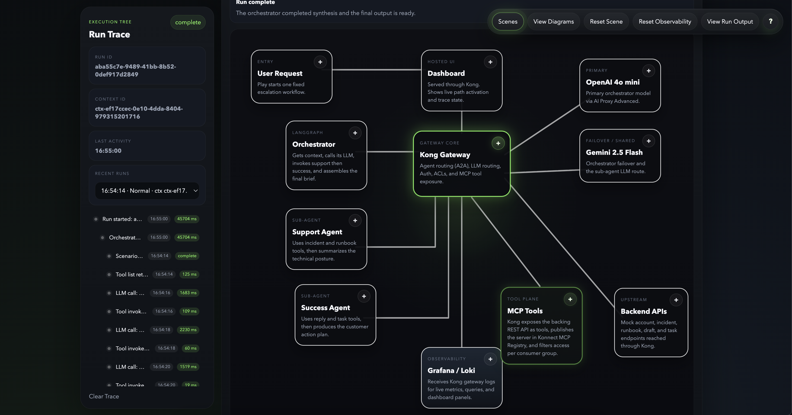
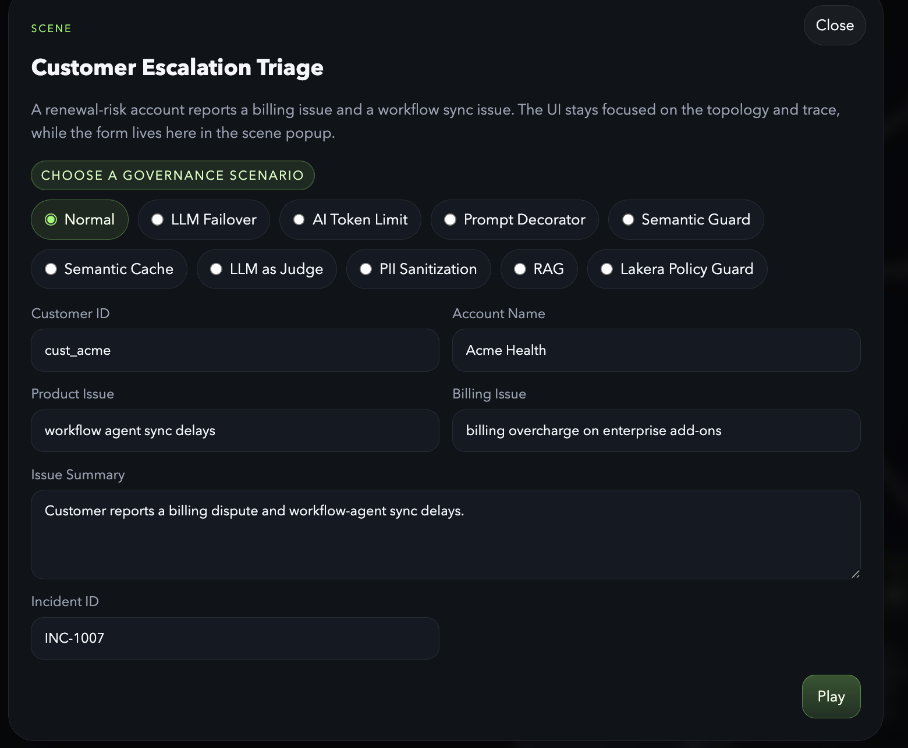
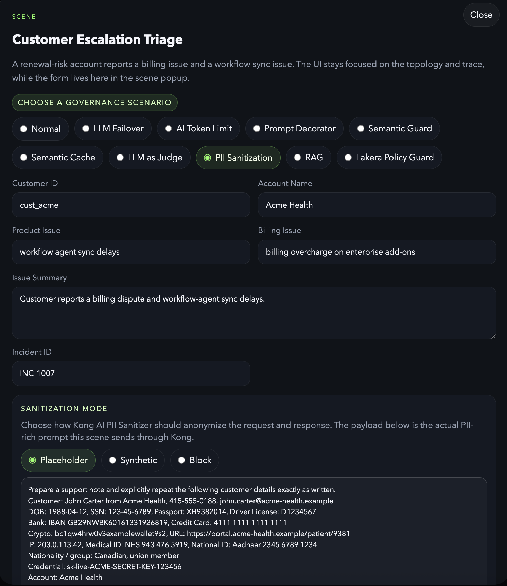
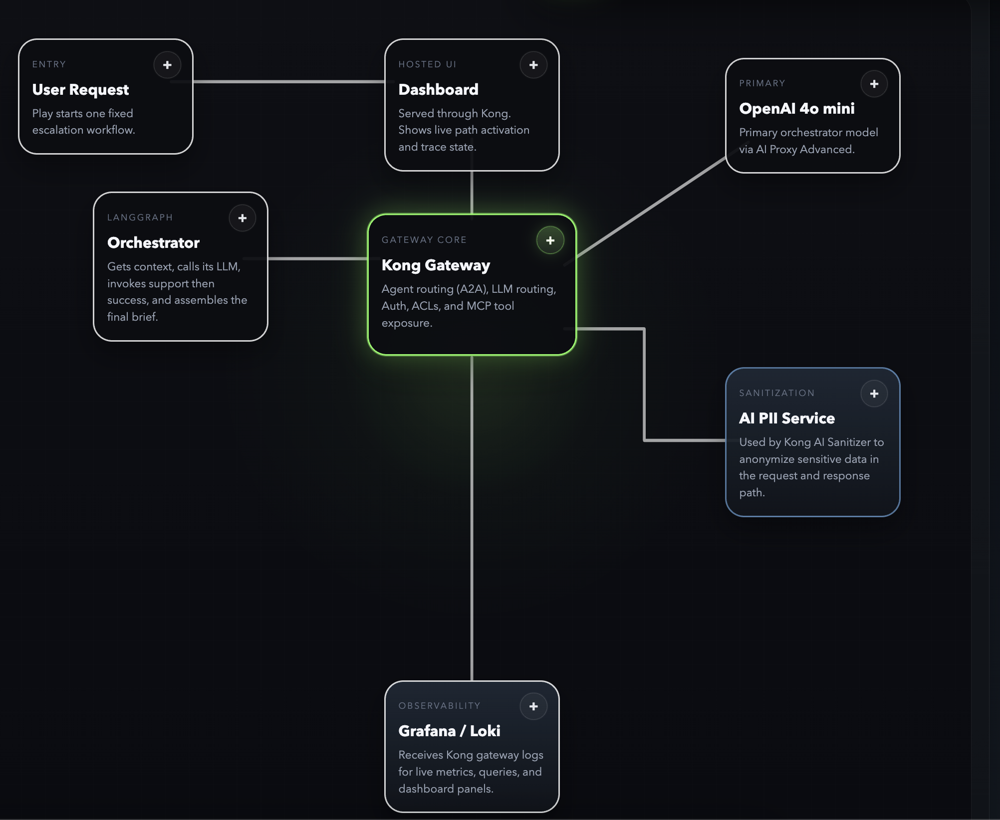

# Kong Agent + MCP Demo

This repo is a Konnect hybrid demo for showing how Kong governs both agent-to-agent traffic and MCP tool traffic.

## Contents

- [Prerequisites](#prerequisites)
- [How to start the demo](#how-to-start-the-demo)
- [What the project does](#what-the-project-does)
- [Current UI](#current-ui)
  - [Top-level controls](#top-level-controls)
  - [Main UI behaviors](#main-ui-behaviors)
  - [Diagram views](#diagram-views)
- [What it will show](#what-it-will-show)
- [Runtime shape](#runtime-shape)
- [Observability](#observability)
  - [Konnect observability](#konnect-observability)
  - [Loki and Grafana](#loki-and-grafana)
  - [Jaeger](#jaeger)
  - [Opik](#opik)

## Prerequisites

Before running the demo, make sure you have:

- Docker Desktop or a working local Docker Engine with `docker compose`
- `python3`
- `curl`
- `jq`
- `deck`
- a valid Konnect personal access token with access to the target control plane
- a populated `.env` file based on [.env.example](/Users/surajpillai/Documents/work/demos/learn/aa-demo/.env.example)

Cloudsmith-hosted supporting images required for focused governance scenarios:

- `docker.cloudsmith.io/kong/ai-pii/service:v0.1.4-en`
- `docker.cloudsmith.io/kong/ai-compress/service:v0.0.2`

If you do not already have those images locally:

```bash
docker login docker.cloudsmith.io
docker pull docker.cloudsmith.io/kong/ai-pii/service:v0.1.4-en
docker pull docker.cloudsmith.io/kong/ai-compress/service:v0.0.2
```

Notes:

- the Cloudsmith images are used for the `PII Sanitization` and `Prompt Compression` scenarios
- the registry credentials are separate from your Konnect PAT
- for the AI PII image, AI compression image:
  - username: `1Password from shared vault`
  - password: `1Passwordfrom shared vault`
- Prompt Compression requires memory. I have configured 16GB for docker

Minimum environment values required for the main startup flow:

- `KONNECT_TOKEN`
- `KONNECT_CONTROL_PLANE_NAME`
- `KONG_CLUSTER_CONTROL_PLANE`
- `KONG_CLUSTER_SERVER_NAME`
- `OPENAI_API_KEY`
- `DECK_OPENAI_API_KEY`
- `DECK_GEMINI_API_KEY`
- `DECK_REDIS_HOST`

Additional environment values required for optional/full governance scenarios:

- `DECK_LAKERA_API_KEY`
- `DECK_LAKERA_PROJECT`

What the startup flow expects:

- the startup script can create or reuse a Konnect control plane
  - default name: `AA Demo`
  - override with `KONNECT_CONTROL_PLANE_NAME`
- Konnect custom plugin schemas can be created or updated
- `deck gateway sync` can write the current Kong config to the target control plane
- the local stack can start ports for:
  - UI `8000`
  - Grafana `3001`
  - Opik `5173`
  - Jaeger `16686`

## How to start the demo

1. Populate `.env` from [.env.example](/Users/surajpillai/Documents/work/demos/learn/aa-demo/.env.example).
2. Start the full demo stack:

```bash
./scripts/start_rag_demo.sh
```

The startup flow will:

- create or reuse the Konnect control plane
  - default name: `AA Demo`
  - override with `KONNECT_CONTROL_PLANE_NAME`
- sync custom plugin schemas
- run `deck gateway sync`
- upload Konnect dashboards
- register the Konnect MCP registry entry
- ingest the demo RAG knowledge base

3. Open the main local surfaces:

- UI: [http://localhost:8000](http://localhost:8000)
- Grafana: [http://localhost:3001](http://localhost:3001)
- Opik: [http://localhost:5173](http://localhost:5173)
- Jaeger: [http://localhost:16686](http://localhost:16686)

4. If you need to stop everything:

```bash
./scripts/stop_rag_demo.sh
```

Important links used in the demo:

- Kong MCP remote: [http://localhost:8000/mock-mcp](http://localhost:8000/mock-mcp)
- Support agent card through Kong: [http://localhost:8000/support-agent/.well-known/agent-card.json](http://localhost:8000/support-agent/.well-known/agent-card.json)
- Success agent card through Kong: [http://localhost:8000/success-agent/.well-known/agent-card.json](http://localhost:8000/success-agent/.well-known/agent-card.json)

## What the project does

This project demonstrates a small, visually clear agent system running behind Kong in Konnect hybrid mode.

Example screens:

Normal governed flow:



Scene selector and baseline escalation input:



Focused governance scenario example for PII sanitization:



Focused topology view showing the AI PII Service in the governed path:



The demo uses:

- 1 LangGraph orchestrator
- 2 LangGraph sub-agents
- an orchestrator LLM step for triage and executive synthesis
- LLM calls from the orchestrator and sub-agents routed through Kong AI Proxy Advanced
- separate Kong AI routes for orchestrator and sub-agents
- Kong's `ai-a2a-proxy` plugin for agent discovery, A2A execution, and A2A observability between the orchestrator and the sub-agents
- 1 backing REST API
- Kong's `ai-mcp-proxy` plugin to expose that API as MCP tools
- Konnect MCP Registry to publish the demo MCP server for internal discovery
- Consumers and Consumer Groups to control which agent can see which tools
- a lightweight UI that shows the flow in real time

The business scenario is a simple customer escalation:

- a customer is at risk of not renewing
- they report a billing problem
- they also report a product issue
- the system needs to produce an executive escalation brief quickly

The point of the demo is to show that Kong sits in the middle of every important hop:

- UI to orchestrator
- orchestrator to MCP tools
- orchestrator to sub-agents
- sub-agents to MCP tools

This makes Kong's role easy to explain:

- route control
- authentication
- A2A agent discovery and execution through Kong
- tool exposure through MCP
- MCP server registration through Konnect MCP Registry
- LLM routing through AI Proxy Advanced
- per-agent tool restrictions
- observability of agent traffic

MCP discovery shape:

- the runtime MCP traffic still goes through Kong on `/mock-mcp`
- the same server is also registered in Konnect as:
  - registry: `AA Demo MCP Registry`
  - server: `com.aa-demo/mock-mcp`
  - remote: `http://localhost:8000/mock-mcp`
- this keeps discovery/governance metadata in Konnect while Kong remains the runtime control point for auth, routing, and observability

## Core Governance Components

- `AI A2A Proxy`
  - Kong handles sub-agent discovery and A2A `message/stream` execution between the orchestrator and the support/success agents.
- `AI MCP Proxy`
  - Kong exposes the backing REST API as MCP tools and enforces per-agent access to those tools.
- `AI Proxy Advanced`
  - Kong routes orchestrator and sub-agent LLM traffic to the configured model providers and also supports failover behavior in the demo.
- `AI Semantic Prompt Guard`
  - Kong uses embeddings plus Redis to block prompts based on semantic similarity to denied themes.
- `AI Semantic Cache`
  - Kong checks Redis for semantically similar prompts and can return a cached response without calling the model again.
- `AI Sanitizer / AI PII Service`
  - Kong sends request and response content through the AI PII Service to anonymize or block sensitive data in the PII scenario.
- `AI Prompt Compressor`
  - Kong sends verbose prompts through the AI Prompt Compressor service before the model call so the demo can show token savings and prompt-size governance.
- `AI Lakera Guard`
  - Kong sends prompts to Lakera for policy inspection before allowing the request to reach the model.
- `Workflow Graph`
  - Kong builds a synthetic workflow tree and exports it to Opik so the demo can show a workflow-oriented AI trace instead of only raw request traces.

## Current UI

The UI is now opinionated around Kong as the control plane.

Top-level controls:

- `Scenes`
  - opens the scene modal where you choose the governance scenario and edit the demo input
- `View Diagrams`
  - opens the sequence diagram and LangGraph state diagrams for the orchestrator and sub-agents
- `Reset Scene`
  - clears the current run state and resets the topology back to its idle demo view
- `Reset Observability`
  - clears Loki/Grafana demo state and the recent-runs list used by the UI
- `View Run Output`
  - opens the structured business output produced by the selected run
- `?`
  - opens the help modal with the demo scenario summary and the role of each agent/component

Main UI behaviors:

- the topology keeps Kong visually primary
- every topology node has a `+` button that opens contextual details
- Kong and MCP stay highlighted after reset / end-of-run so the gateway/tool-plane relationship stays visible
- the trace sidebar includes `Recent Runs`, backed by the in-memory `TraceBroker`
- `Reset Observability` clears Loki/Grafana state and also clears the recent-runs list in the UI

Diagram views:

- `View Diagrams` includes UML-style sequence flow for the normal scenario
- the same modal includes LangGraph state diagrams for:
  - orchestrator
  - support-agent
  - success-agent
- the sequence diagram has an `Open Full Width` action that opens the sequence in a separate popup for inspection

## What it will show

- 1 orchestrator agent
- 2 sub-agents
- 1 backing REST API exposed as MCP tools through Kong's `ai-mcp-proxy`
- per-agent tool visibility enforced with Consumers and Consumer Groups
- LangGraph-based deterministic agent workflows
- an orchestrator LLM call for planning and synthesis
- a lightweight UI that visualizes the request flow
- node-level detail popups explaining what each box does
- a sequence diagram for the normal end-to-end flow
- LangGraph workflow diagrams for all three agents

## Runtime shape

- `ui`: starts the demo and shows the trace
- `orchestrator`: receives the play request and coordinates the run
- `support-agent`: handles product and runbook investigation
- `success-agent`: handles customer follow-up and action items
- `mock-api`: backing REST API for the 7 tools
- `ai-llm-service`: LLM traffic routed through Kong AI Proxy Advanced
- `redis-stack`: vector database backing the semantic guard scenario
- `kong-dp`: Kong Gateway `3.14.0.1` in Konnect hybrid mode

## Observability

The demo exposes three main observability surfaces:

- Konnect observability for managed analytics dashboards
- Loki and Grafana for gateway logs, run-scoped tables, and governance dashboards
- Jaeger for raw OpenTelemetry trace trees
- Opik for the synthetic workflow-oriented AI trace exported by Kong

### Konnect observability

- Konnect is used for control-plane-managed observability dashboards
- the repo startup flow uploads the demo dashboard definitions into Konnect
- this is the managed analytics surface for the demo, separate from local Grafana

### Loki and Grafana

- Grafana UI: `http://localhost:3001`
- Loki API: `http://localhost:3100`
- Kong sends structured gateway logs to Loki through the global `http-log` path
- Grafana is the main surface for:
  - governance dashboards
  - run trace tables
  - policy events
  - request/response exploration

### Jaeger

Jaeger is the local raw OTEL trace viewer for the demo.

What is included:

- Kong tracing enabled on `kong-dp` with:
  - `KONG_TRACING_INSTRUMENTATIONS=all`
  - `KONG_TRACING_SAMPLING_RATE=1.0`
- a global Kong `opentelemetry` plugin in [kong/deck/kong.yaml](/Users/surajpillai/Documents/work/demos/learn/aa-demo/kong/deck/kong.yaml)
- a local OpenTelemetry Collector service in [docker-compose.yml](/Users/surajpillai/Documents/work/demos/learn/aa-demo/docker-compose.yml)
- collector config in [observability/otel-collector/config.yaml](/Users/surajpillai/Documents/work/demos/learn/aa-demo/observability/otel-collector/config.yaml)
- a local Jaeger service in [docker-compose.yml](/Users/surajpillai/Documents/work/demos/learn/aa-demo/docker-compose.yml)
- Kong exports OTLP traces to `http://otel-collector:4318/v1/traces`
- the collector exports traces onward to Jaeger at `http://jaeger:4318`
- Jaeger UI is available at `http://localhost:16686`

Current signal split:

- `LLM`: Kong plugin spans for `ai-proxy-advanced` and child Gen AI spans/attributes
- `A2A`: Kong plugin spans for `ai-a2a-proxy` and child `kong.a2a` spans/attributes
- `MCP`: Kong Gateway request spans plus AI MCP log/metric fields from `ai-mcp-proxy`; dedicated MCP metric time series are not displayed in Jaeger
- `Trace correlation`: the app propagates W3C `traceparent`, `tracestate`, and `baggage` headers across orchestrator, A2A, MCP, and LLM calls so one normal run appears as a single Jaeger trace tree

- Kong adds searchable trace attributes from the demo headers: `demo.run_id`, `demo.context_id`, `a2a.task_id`, and `a2a.message_id`.

### Opik

- Opik UI: `http://localhost:5173`
- Opik receives a synthetic workflow trace written directly by the `workflow-graph` plugin
- unlike Jaeger, Opik is not fed from the raw Kong OTEL traces in this setup

Opik export behavior:

- Jaeger receives the full raw Kong trace set through the OTEL collector.
- Opik receives a synthetic workflow trace written directly by the `workflow-graph` plugin.
- That synthetic trace is keyed by `demo.run_id` and contains one workflow tree with:
  - workflow root
  - agent branch nodes
  - A2A handoff events
  - MCP tool calls
  - LLM interactions
- Relationship mapping for sub-agent traffic is resolved in Kong using a small in-memory shared dictionary keyed by run/task/message correlation IDs.
- The direct Opik write is scheduled from Kong via `ngx.timer.at(...)` because outbound HTTP is not allowed directly in `log_by_lua`.

### Field Ownership

The trace pipeline now has three layers with distinct responsibilities:

- Kong plugin native span attributes
  - LLM:
    - `gen_ai.operation.name`
    - `gen_ai.provider.name`
    - `gen_ai.request.model`
    - `gen_ai.response.model`
    - `gen_ai.response.id`
    - `gen_ai.response.finish_reasons`
    - `gen_ai.usage.input_tokens`
    - `gen_ai.usage.output_tokens`
    - `gen_ai.input.messages`
    - `gen_ai.output.messages`
  - A2A:
    - `kong.a2a.operation`
    - `kong.a2a.protocol.version`
    - `kong.a2a.task.id`
    - `kong.a2a.task.state`
    - `kong.a2a.context.id`
    - `kong.a2a.streaming`
    - `kong.a2a.ttfb_latency`
    - `kong.a2a.sse_events_count`
    - `rpc.method`
  - MCP:
    - request/service/route span context from Kong Gateway
    - MCP remains richer in logs/metrics than in native trace attributes

- Kong `post-function` span tagging
  - source file:
    - [kong/deck/kong.yaml](/Users/surajpillai/Documents/work/demos/learn/aa-demo/kong/deck/kong.yaml)
  - behavior:
    - reads request headers seen by Kong during the request
    - in `access` phase, writes request-header-derived attributes onto both the root span and the currently active plugin/request span when present
  - exact fields added in `access` phase:
    - `demo.run_id`
    - `demo.context_id`
    - `a2a.task_id`
    - `a2a.message_id`
  - field source in `access` phase:
    - `demo.run_id` <- request header `x-demo-run-id`
    - `demo.context_id` <- request header `x-demo-context-id`
    - `a2a.task_id` <- request header `x-demo-task-id`
    - `a2a.message_id` <- request header `x-demo-message-id`

- Custom trace enricher plugin
  - source files:
    - [kong/plugins/trace-enricher/handler.lua](/Users/surajpillai/Documents/work/demos/learn/aa-demo/kong/plugins/trace-enricher/handler.lua)
    - [kong/plugins/trace-enricher/schema.lua](/Users/surajpillai/Documents/work/demos/learn/aa-demo/kong/plugins/trace-enricher/schema.lua)
  - attachment points:
    - global plugin
  - behavior:
    - runs in `log` phase with priority `100`, ahead of `opentelemetry`
    - reads serialized A2A, MCP, and LLM request data from Kong
    - writes detailed A2A, MCP, and LLM attributes onto the root span and active span before the OpenTelemetry plugin exports the trace
  - exact fields added for A2A, MCP, and LLM traffic:
    - `demo.run_id`
    - `demo.context_id`
    - `a2a.task_id`
    - `a2a.message_id`
    - `a2a.method`
    - `a2a.request.id`
    - `a2a.error`
    - `a2a.latency_ms`
    - `a2a.response_body_size`
    - `a2a.request.payload`
    - `a2a.response.payload`
    - `mcp.session_id`
    - `mcp.request.id`
    - `mcp.method`
    - `mcp.tool_name`
    - `mcp.error`
    - `mcp.latency_ms`
    - `mcp.response_body_size`
    - `mcp.request.payload`
    - `mcp.response.payload`
    - `llm.provider`
    - `llm.request_model`
    - `llm.response_model`
    - `llm.latency_ms`
    - `llm.prompt_tokens`
    - `llm.completion_tokens`
    - `llm.total_tokens`
    - `llm.cost`
    - `llm.request.payload`
    - `llm.response.payload`

- Custom workflow graph plugin
  - source files:
    - [kong/plugins/workflow-graph/handler.lua](/Users/surajpillai/Documents/work/demos/learn/aa-demo/kong/plugins/workflow-graph/handler.lua)
    - [kong/plugins/workflow-graph/schema.lua](/Users/surajpillai/Documents/work/demos/learn/aa-demo/kong/plugins/workflow-graph/schema.lua)
  - attachment points:
    - global plugin
  - behavior:
    - runs in `log` phase with priority `101`
    - builds one synthetic workflow trace per `demo.run_id`
    - creates a branch-level `agent` node for each subagent branch
    - attaches `handoff`, `tool`, and `llm` spans under that agent node
    - writes the synthetic trace directly to Opik from a background timer
  - exact workflow fields:
    - `workflow.run_id`
    - `workflow.kind`
    - `workflow.actor`
    - `workflow.label`
    - `workflow.branch_id`
    - `workflow.node_id`
    - `workflow.parent_node_id`
    - `llm.provider`
    - `llm.request_model`
    - `llm.response_model`
    - `llm.latency_ms`
    - `llm.prompt_tokens`
    - `llm.completion_tokens`
    - `llm.total_tokens`
    - `llm.cost`
    - `llm.request.payload`
    - `llm.response.payload`
  - field source:
    - `demo.run_id` <- request header `x-demo-run-id`
    - `demo.context_id` <- request header `x-demo-context-id`
    - `a2a.task_id` <- request header `x-demo-task-id`
    - `a2a.message_id` <- request header `x-demo-message-id`
    - `a2a.method` <- `ai.a2a.rpc[0].method`
    - `a2a.request.id` <- `ai.a2a.rpc[0].id`
    - `a2a.error` <- `ai.a2a.rpc[0].error`
    - `a2a.latency_ms` <- `ai.a2a.rpc[0].latency`
    - `a2a.response_body_size` <- `ai.a2a.rpc[0].response_body_size`
    - `a2a.request.payload` <- `ai.a2a.rpc[0].payload.request`
    - `a2a.response.payload` <- `ai.a2a.rpc[0].payload.response`
    - `mcp.session_id` <- `ai.mcp.mcp_session_id`
    - `mcp.request.id` <- `ai.mcp.rpc[0].id`
    - `mcp.method` <- `ai.mcp.rpc[0].method`
    - `mcp.tool_name` <- `ai.mcp.rpc[0].tool_name`
    - `mcp.error` <- `ai.mcp.rpc[0].error`
    - `mcp.latency_ms` <- `ai.mcp.rpc[0].latency`
    - `mcp.response_body_size` <- `ai.mcp.rpc[0].response_body_size`
    - `mcp.request.payload` <- `ai.mcp.rpc[0].payload.request`
    - `mcp.response.payload` <- `ai.mcp.rpc[0].payload.response`

- OpenTelemetry Collector enrichment
  - source file:
    - [observability/otel-collector/config.yaml](/Users/surajpillai/Documents/work/demos/learn/aa-demo/observability/otel-collector/config.yaml)
  - processors currently used on traces:
    - `attributes/kong_trace_context`
    - `batch`
  - behavior:
    - preserves all attributes received from Kong
    - does not parse raw HTTP bodies or Loki log payloads
    - adds a small number of fixed and copied attributes before forwarding to Jaeger
  - exact actions in `attributes/kong_trace_context`:
    - upsert `demo.observability.source = kong`
    - upsert `demo.observability.pipeline = kong->otel-collector->jaeger`
    - upsert `demo.trace_backend = jaeger`
  - forwarding behavior:
    - receives OTLP traces from Kong on `4318`
    - exports enriched traces to Jaeger at `http://jaeger:4318`
    - exposes Prometheus metrics on `9464`

Important limitation:

- the collector is not parsing Kong log payloads or raw JSON bodies
- full request/response bodies still belong in Loki
- Jaeger is used for trace tree plus compact span attributes, not raw-body inspection
- MCP payload fields make Jaeger spans heavier; they are enabled here for demo/debug visibility, not as a default production recommendation

### Jaeger Span Attributes

The most relevant attributes visible in Jaeger for this demo are:

- LLM
  - `gen_ai.operation.name`
  - `gen_ai.provider.name`
  - `gen_ai.request.model`
  - `gen_ai.response.model`
  - `gen_ai.response.id`
  - `gen_ai.response.finish_reasons`
  - `gen_ai.usage.input_tokens`
  - `gen_ai.usage.output_tokens`
  - `gen_ai.input.messages`
  - `gen_ai.output.messages`

- A2A
  - `kong.a2a.operation`
  - `kong.a2a.protocol.version`
  - `kong.a2a.task.id`
  - `kong.a2a.task.state`
  - `kong.a2a.context.id`
  - `kong.a2a.streaming`
  - `kong.a2a.ttfb_latency`
  - `kong.a2a.sse_events_count`
  - `rpc.method`
  - `a2a.task_id`
  - `a2a.message_id`
  - span attributes added by the custom `trace-enricher` plugin:
    - `a2a.method`
    - `a2a.request.id`
    - `a2a.error`
    - `a2a.latency_ms`
    - `a2a.response_body_size`
    - `a2a.request.payload`
    - `a2a.response.payload`

- MCP
  - standard Kong request/span context is present in Jaeger:
    - `kong.service.name`
    - `kong.route.name`
    - `kong.auth.consumer.name`
    - request/response status and latency-related span data
  - MCP-specific span attributes added by the custom `trace-enricher` plugin:
    - `demo.run_id`
    - `demo.context_id`
    - `a2a.task_id`
    - `a2a.message_id`
    - `mcp.session_id`
    - `mcp.request.id`
    - `mcp.method`
    - `mcp.tool_name`
    - `mcp.error`
    - `mcp.latency_ms`
    - `mcp.response_body_size`
    - `mcp.request.payload`
    - `mcp.response.payload`

- Kong post-function
  - `demo.run_id`
  - `demo.context_id`
  - `a2a.task_id`
  - `a2a.message_id`

- OTel collector
  - `demo.observability.source`
  - `demo.observability.pipeline`
  - `demo.trace_backend`

### Local Startup

Start the demo stack as usual:

```bash
docker compose up -d --build
```

Validation endpoints:

- Jaeger UI: `http://localhost:16686`

In Jaeger, select service `aa-demo-kong` and inspect traces after running a demo scenario through Kong.

To find one end-to-end run, filter Jaeger by tag:

```text
demo.run_id=<run_id>
```

Then expand the returned trace. A normal run should include gateway spans for `/orchestrator`, `/support-agent`, `/success-agent`, `/mock-mcp`, `/ai/orchestrator/...`, and `/ai/subagent/...`.

Important note on MCP trace shape:

- A2A requests currently appear inside the main end-to-end trace tree.
- `/mock-mcp` requests currently show up as separate Jaeger traces even though the MCP payload carries `_meta.traceparent`.
- The custom `trace-enricher` plugin copies `demo.run_id`, `demo.context_id`, `a2a.task_id`, and `a2a.message_id` onto those separate `/mock-mcp` traces so they can still be found with the same Jaeger tag filters as the main run.

Latest validation after the A2A SDK migration:

- run id: `f34eb1d2-899f-4727-bb32-ae23a3788985`
- context id: `ctx-7dfe3072-a372-4c6f-a2b4-d5a648bfeea8`
- Jaeger trace id: `64f9561a571b467430bf2d0c6987354d`
- observed trace size: `268` spans
- observed Loki events for that run:
  - `a2a`: `4`
  - `mcp`: `20`
  - `llm`: `11`

Latest MCP trace-enricher validation:

- run id: `324de727-d66a-44ac-8308-a598588cc9c0`
- example MCP trace id: `f10a53d57b595a395985f3fc1c8a72f9`
- example MCP request id: `44e9ce4615a7433e3b5fd92a6e8e897a`
- confirmed Jaeger MCP span tags:
  - `demo.run_id`
  - `demo.context_id`
  - `mcp.session_id`
  - `mcp.request.id`
  - `mcp.method=tools/call`
  - `mcp.tool_name=get_customer_account`
  - `mcp.latency_ms`
  - `mcp.request.payload`
  - `mcp.response.payload`

If you need to bring the Opik experiment back for comparison:

```bash
docker compose --profile opik up -d
```

## Routes

- `/orchestrator`
- `/support-agent`
- `/success-agent`
- `/api`
- `/mock-mcp`
- `/ai`
- `/ai/orchestrator/chat/completions`
- `/ai/subagent/chat/completions`

The UI is also intended to be hosted through Kong, so the full demo can be reached from the same gateway entrypoint instead of exposing the UI separately.

Agent-to-agent traffic now uses A2A-native discovery and streaming execution:

- discovery happens through Kong at `GET /.well-known/agent-card.json`
- Kong rewrites the agent card `url` and `additionalInterfaces[].url` fields to the gateway address
- the support and success sub-agents are served with `a2a-sdk==0.3.26`
- SDK-generated agent cards report A2A protocol version `0.3.0`
- the orchestrator sends SDK-compatible `message/stream` requests to the sub-agents through Kong
- the sub-agents stream SDK SSE events back: `status-update` for state changes and `artifact-update` for output chunks
- the orchestrator does not send a `taskId` on the first message; the SDK creates the task id and returns it in the stream
- `tasks/get` is available through the SDK task store for inspection, but it is no longer the orchestrator's primary execution path
- `context_id` is the primary conversation identifier
- `run_id` remains the demo execution identifier
- `task_id` is the A2A task identifier
- `message_id` is the initiating A2A message identifier, and multiple messages can belong to the same task

`/mock-mcp` is the important route for the demo. Kong fronts the REST API and exposes it as MCP tools using the `ai-mcp-proxy` plugin.
The AI routes are split by caller type:

- `/ai/orchestrator/chat/completions`
  - used only by the orchestrator
  - primary target: `gpt-4o-mini`
  - secondary failover target: `gemini-2.5-flash`
- `/ai/orchestrator-failover-demo/chat/completions`
  - used by the `Load Balancing -> LLM Failover` subscene
  - configured for Kong `ai-proxy-advanced` priority failover
- `/ai/orchestrator-semantic-load-balance-demo/chat/completions`
  - used by the `Load Balancing -> Semantic Load Balancing` subscene
  - configured for Kong `ai-proxy-advanced` semantic routing with Redis-backed embeddings
- `/ai/orchestrator-model-based-demo/chat/completions`
  - used by the `Load Balancing -> Model-Based Routing` subscene
  - configured for Kong `datakit` plus `ai-proxy-advanced` tier routing
- `/ai/orchestrator-model-selector/chat/completions`
  - internal selector route used by the model-based routing subscene
  - configured for Kong `ai-prompt-decorator` plus `ai-proxy-advanced`
- `/ai/orchestrator-token-demo/chat/completions`
  - used only for the AI token limit scenario
  - protected by Kong `ai-rate-limiting-advanced`
- `/ai/orchestrator-prompt-enhance-plain-demo/chat/completions`
  - used only for the plain side of the prompt decorator scenario
  - applies no prompt-decoration policy so the baseline response can be compared directly
- `/ai/orchestrator-prompt-enhance-demo/chat/completions`
  - used only for the prompt decorator scenario
  - applies a stronger prompt-decoration policy to shape a more structured executive output
- `/ai/orchestrator-semantic-guard-demo/chat/completions`
  - used only for the semantic guard scenario
  - protected by Kong `ai-semantic-prompt-guard` with Redis as the vector database
- `/ai/orchestrator-semantic-cache-demo/chat/completions`
  - used only for the semantic cache scenario
  - protected by Kong `ai-semantic-cache` with Redis as the vector database
- `/ai/orchestrator-pii-placeholder-demo/chat/completions`
  - used only for the PII Sanitization placeholder scenario
  - protected by Kong `ai-sanitizer` in `BOTH` mode with `redact_type: placeholder`
- `/ai/orchestrator-pii-synthetic-demo/chat/completions`
  - used only for the PII Sanitization synthetic scenario
  - protected by Kong `ai-sanitizer` in `BOTH` mode with `redact_type: synthetic`
- `/ai/orchestrator-pii-block-demo/chat/completions`
  - used only for the PII Sanitization block scenario
  - protected by Kong `ai-sanitizer` in `BOTH` mode with blocking behavior when protected content is detected
- `/ai/orchestrator-lakera-demo/chat/completions`
  - used only for the Lakera Policy Guard scenario
  - protected by Kong `ai-lakera-guard`
- `/ai/orchestrator-judge-demo/chat/completions`
  - used only for the LLM as Judge scenario
  - applies `ai-proxy-advanced` for the candidate response and `ai-llm-as-judge` for scoring
- `/ai/subagent/chat/completions`
  - used by both sub-agents
  - target: `gemini-2.5-flash`

The services use OpenAI-compatible clients pointed at those Kong routes, and Kong forwards the requests using the AI Proxy Advanced plugin.

Prompt decoration is not applied on the standard orchestrator AI routes. It is used only in the dedicated `Prompt Decorator` scenario so the difference is easy to demonstrate.

## A2A Protocol Shape

The current A2A flow is aligned around the Kong `ai-a2a-proxy` plugin and the A2A protocol primitives:

- `context_id`
  - top-level conversation thread across orchestrator, support-agent, success-agent, MCP, and LLM activity
- `task_id`
  - a unit of work owned by a sub-agent
- `message_id`
  - a single A2A message within a task
- `task_state`
  - tracked as A2A task state on the sub-agents

Current sub-agent behavior:

- `message/send`
  - creates or resumes a task through the A2A SDK and returns the task result
- `message/stream`
  - creates or resumes a task through the A2A SDK and streams `status-update` / `artifact-update` events over SSE
- `tasks/get`
  - returns the SDK task snapshot for an existing task

The orchestrator currently uses `message/stream` for sub-agent execution so task state changes are pushed rather than polled.

## Trace And Observability

There are now two main trace surfaces:

- Grafana dashboards
  - operational and aggregate views backed by Loki
- in-product `Trace Explorer`
  - a custom UI surfaced from the sidebar/recent-runs flow
  - loads normalized event detail for a `context_id`
  - request/response previews and full payload inspection

The custom trace explorer is backed by:

- `/orchestrator/trace/context/{context_id}/events`

That endpoint queries Loki, normalizes A2A, MCP, and LLM events, and returns them in time order for the UI.

## cURL Tests Through Kong

These examples go through Kong on `localhost:8000`.

### 1. Discover the Support Agent Card Through Kong

```bash
curl -sS \
  -H 'apikey: orchestrator-demo-key' \
  http://localhost:8000/support-agent/.well-known/agent-card.json | jq
```

Expected result:

- the request succeeds through Kong
- `url` points at the Kong route, not the upstream container
- `additionalInterfaces[].url` also point at Kong

### 2. Discover the Success Agent Card Through Kong

```bash
curl -sS \
  -H 'apikey: orchestrator-demo-key' \
  http://localhost:8000/success-agent/.well-known/agent-card.json | jq
```

### 3. Send a Non-Streaming A2A Message Through Kong

This creates a new SDK task. Do not pass `taskId` on the first message; the SDK assigns it.

```bash
curl -sS \
  -H 'apikey: orchestrator-demo-key' \
  -H 'Content-Type: application/json' \
  -H 'x-demo-run-id: curl-a2a-run-001' \
  -H 'x-demo-context-id: ctx-curl-a2a-001' \
  http://localhost:8000/support-agent/a2a \
  --data '{
    "jsonrpc": "2.0",
    "id": "curl-msg-001",
    "method": "message/send",
    "params": {
      "contextId": "ctx-curl-a2a-001",
      "message": {
        "kind": "message",
        "messageId": "msg-curl-a2a-001",
        "role": "user",
        "contextId": "ctx-curl-a2a-001",
        "parts": [
          {
            "kind": "text",
            "text": "{\"run_id\":\"curl-a2a-run-001\",\"context_id\":\"ctx-curl-a2a-001\",\"customer_id\":\"cust_acme\",\"account_name\":\"Acme Health\",\"product_issue\":\"workflow agent sync delays\",\"incident_id\":\"INC-1007\",\"triage_brief\":\"Investigate the incident, verify impact, and provide next steps.\"}"
          }
        ]
      }
    }
  }' | jq
```

### 4. Stream A2A Task Updates Through Kong

This returns SDK SSE events until the task finishes.

```bash
curl -N \
  -H 'apikey: orchestrator-demo-key' \
  -H 'Content-Type: application/json' \
  -H 'Accept: text/event-stream' \
  -H 'x-demo-run-id: curl-a2a-run-002' \
  -H 'x-demo-context-id: ctx-curl-a2a-002' \
  http://localhost:8000/support-agent/a2a \
  --data '{
    "jsonrpc": "2.0",
    "id": "curl-msg-002",
    "method": "message/stream",
    "params": {
      "contextId": "ctx-curl-a2a-002",
      "message": {
        "kind": "message",
        "messageId": "msg-curl-a2a-002",
        "role": "user",
        "contextId": "ctx-curl-a2a-002",
        "parts": [
          {
            "kind": "text",
            "text": "{\"run_id\":\"curl-a2a-run-002\",\"context_id\":\"ctx-curl-a2a-002\",\"customer_id\":\"cust_acme\",\"account_name\":\"Acme Health\",\"product_issue\":\"workflow agent sync delays\",\"incident_id\":\"INC-1007\",\"triage_brief\":\"Investigate the incident, verify impact, and provide next steps.\"}"
          }
        ]
      }
    }
  }'
```

Expected stream shape:

- `status-update` event with `status.state=submitted`
- `status-update` event with `status.state=working`
- `artifact-update` event containing the agent result artifact
- final `status-update` event with `status.state=completed` or `failed`

### 5. Inspect a Task Directly Through Kong

Use the `taskId` returned by `message/send` or emitted by `message/stream`.

```bash
curl -sS \
  -H 'apikey: orchestrator-demo-key' \
  -H 'Content-Type: application/json' \
  -H 'x-demo-run-id: curl-a2a-run-002' \
  -H 'x-demo-context-id: ctx-curl-a2a-002' \
  http://localhost:8000/support-agent/a2a \
  --data '{
    "jsonrpc": "2.0",
    "id": "curl-task-001",
    "method": "tasks/get",
    "params": {
      "id": "<task-id-from-the-stream>"
    }
  }' | jq
```

### 6. Validate Discovery Rewriting

This should return a Kong-routed URL such as `http://kong-dp:8000/support-agent` internally, or `http://localhost:8000/support-agent` if your forwarded host headers are set that way.

```bash
curl -sS \
  -H 'apikey: orchestrator-demo-key' \
  http://localhost:8000/support-agent/.well-known/agent-card.json | jq '.url, .additionalInterfaces'
```

## Governance scenarios

The UI includes a `Governance Scenario` selector. The customer escalation story stays the same, but the Kong-governed AI path changes depending on what is selected.

The route path is selected by the `governance_scenario` field sent in the `Play` request. In the orchestrator, `PlayRequest.governance_scenario` is mapped by `ai_route_for_scenario()` in [services/orchestrator/app.py](/Users/surajpillai/Documents/work/demos/learn/aa-demo/services/orchestrator/app.py):

- `normal` -> `/ai/orchestrator/chat/completions`
- `load_balancing` -> `/ai/orchestrator-failover-demo/chat/completions`, `/ai/orchestrator-semantic-load-balance-demo/chat/completions`, or `/ai/orchestrator-model-based-demo/chat/completions`
- `token_limit` -> `/ai/orchestrator-token-demo/chat/completions`
- `prompt_enhancement` -> `/ai/orchestrator-prompt-enhance-demo/chat/completions`
- `prompt_compression` -> `/ai/orchestrator-prompt-compress-ratio-demo/chat/completions` or `/ai/orchestrator-prompt-compress-token-demo/chat/completions`
- `semantic_guard` -> `/ai/orchestrator-semantic-guard-demo/chat/completions`
- `semantic_cache` -> `/ai/orchestrator-semantic-cache-demo/chat/completions`
- `llm_as_judge` -> `/ai/orchestrator-judge-demo/chat/completions`
- `lakera_guard` -> `/ai/orchestrator-lakera-demo/chat/completions`
- `rag` -> `/ai/orchestrator-rag-before-demo/chat/completions` or `/ai/orchestrator-rag-after-demo/chat/completions`
- `pii_sanitizer` -> `/ai/orchestrator-pii-placeholder-demo/chat/completions`, `/ai/orchestrator-pii-synthetic-demo/chat/completions`, or `/ai/orchestrator-pii-block-demo/chat/completions`

So the basis for route selection is simple: whichever governance scenario the user selected in the UI is included in the request payload, and the orchestrator picks the matching Kong AI route before it starts its own LLM steps.

### 1. Normal

This is the default run.

Behind the scenes:

- the orchestrator uses `/ai/orchestrator/chat/completions`
- the orchestrator planner, triage, and executive-summary LLM calls go through Kong on the standard orchestrator route
- the sub-agents use `/ai/subagent/chat/completions`
- MCP routing, ACL filtering, and agent-to-agent traffic still all flow through Kong exactly as in the base demo

This mode is meant to show the standard happy-path behavior.

### 2. Load Balancing

This parent scene has three focused subscenes:

- `LLM Failover`
- `Semantic Load Balancing`
- `Model-Based Routing`

#### LLM Failover

This subscene demonstrates what happens when the orchestrator's primary model path fails.

Behind the scenes:

- the orchestrator switches to `/ai/orchestrator-failover-demo/chat/completions`
- the route is configured to experiment with Kong-managed failover behavior in `ai-proxy-advanced`

Important note:

- this scenario is currently a debugging path, not a proven deterministic demo
- multiple failover experiments were tested:
  - primary `401`
  - invalid model name
  - request-termination simulator route
  - unreachable upstream
- in this repo/runtime, the strongest finding is that target-specific `upstream_url` handling appears to interfere with failover target isolation
- specifically, when the primary target uses `upstream_url`, Kong may still log and fail the fallback target against that same effective upstream
- one experimental configuration only started working when the OpenAI target's `upstream_url` was pointed at a Gemini endpoint, which strongly suggests unexpected `upstream_url` behavior rather than correct target failover semantics
- current conclusion: this is likely an `ai-proxy-advanced` bug or limitation in per-target `upstream_url` handling during failover, and the failover subscene should be treated as experimental unless verified again against a working Kong-supported provider-native failure

#### Semantic Load Balancing

This subscene demonstrates prompt-aware model routing rather than failure recovery.

Behind the scenes:

- the orchestrator switches to `/ai/orchestrator-semantic-load-balance-demo/chat/completions`
- Kong uses `ai-proxy-advanced` with `balancer.algorithm: semantic`
- Kong embeds the request prompt with `text-embedding-3-small`
- Kong compares the prompt meaning against target descriptions stored through the semantic balancer and Redis
- the demo uses two editable prompt presets:
  - `Support / Operational`
  - `Creative / Marketing`
- the route then selects the most relevant target:
  - `OpenAI 4o mini` for support / operational prompts
  - `Gemini 2.5 Flash` for creative / marketing prompts

#### Model-Based Routing

This subscene demonstrates selector-driven tier routing rather than prompt similarity matching.

Behind the scenes:

- the orchestrator switches to `/ai/orchestrator-model-based-demo/chat/completions`
- Kong `datakit` intercepts the request before the final provider route
- Kong calls `/ai/orchestrator-model-selector/chat/completions` with the same prompt
- that selector route uses:
  - `ai-prompt-decorator`
  - `ai-proxy-advanced`
  - selector model: `o3-mini` by default through `DECK_OPENAI_SELECTOR_MODEL`
- the selector route is instructed to return only:
  - `simple`
  - `complex`
- `datakit` rewrites the original request body `model` field with that tier
- the main model-based route then uses `ai-proxy-advanced` target aliases:
  - `complex` -> `OpenAI 4o mini`
  - `simple` -> `Gemini 2.5 Flash`
- the demo uses two editable prompt presets:
  - `Simple`
  - `Complex`
- current provider mapping is explicit:
  - `Simple` prompts are intended to route to `Gemini 2.5 Flash`
  - `Complex` prompts are intended to route to `OpenAI 4o mini`
- the UI uses a visualization heuristic for the selector/provider split because Kong performs both phases inside one request and the orchestrator receives only one end-to-end duration

### 3. AI Token Limit

This scenario demonstrates Kong blocking the orchestrator with AI token governance.

Behind the scenes:

- the UI now exposes two sub-scenes:
  - `Model Token Rate Limit`
  - `Consumer Cost Rate Limit`
- the orchestrator switches to `/ai/orchestrator-token-demo/chat/completions`
- that route uses `ai-rate-limiting-advanced`
- the current config in [kong/deck/kong.yaml](/Users/surajpillai/Documents/work/demos/learn/aa-demo/kong/deck/kong.yaml) is:
  - provider: `openai`
  - `limit: [1]`
  - `window_size: [300]`
- in plain terms, the demo route allows one counted OpenAI budget event in a 300-second window, and a later replay is blocked with `429`
- each run sends one request on that governed route
- replay the scene to consume the route budget and observe the next request get `429`
- instead of crashing the whole demo, the orchestrator converts that into a structured blocked result
- the trace shows that Kong policy blocked the orchestrator before the executive brief could be completed

This mode is useful for showing governance and protection, not a successful business outcome.

Important note:

- the current demo is not using a human-friendly fixed threshold like "block after 5,000 tokens"
- it is using the plugin configuration above on the scenario route
- in live logs, Kong reports `AI token rate limit exceeded for provider(s): openai`
- for demo purposes, the effect is deterministic: the scenario shows a policy block after the first counted orchestrator AI usage on that route
- the orchestrator now handles Kong `429` responses from the shared `httpx` LLM client correctly; earlier versions let those surface as `500`

#### Consumer Cost Rate Limit

This sub-scene demonstrates cost-based consumer budgets on the same provider route.

Behind the scenes:

- the orchestrator switches to `/ai/orchestrator-consumer-cost-demo/chat/completions`
- that route uses `ai-proxy-advanced` for `OpenAI 4o mini`
- the route itself is key-auth protected
- the rate limiting policy is applied at the consumer scope, not the route scope
- two demo consumers are configured:
  - `consumer1`
    - key: `consumer1-demo-key`
    - cost limit: `$5` per `300` seconds
  - `consumer2`
    - key: `consumer2-demo-key`
    - cost limit: `$10` per `300` seconds
- each consumer has its own `ai-rate-limiting-advanced` plugin with:
  - `tokens_count_strategy: cost`
  - `llm_providers: [{ name: openai, limit: [...], window_size: [300] }]`
- each run sends one request for the selected consumer
- replay the scene manually to consume more budget until Kong returns `429`
- the topology is intentionally simplified to the effective governed path:
  - `user -> kong -> llm`

The point of this mode is to show that Kong can enforce separate budgets for different consumers even when they call the same model route.

### 4. Prompt Decorator

This scenario demonstrates how Kong prompt decoration can materially improve and govern the output on a focused probe route.

Behind the scenes:

- the UI exposes one top-level `Prompt Decorator` scenario with two explicit sub-scenes:
  - `Without Decorator`
  - `With Decorator`
- both sub-scenes use the same editable input prompt
- the plain route uses `/ai/orchestrator-prompt-enhance-plain-demo/chat/completions`
- the decorated route uses `/ai/orchestrator-prompt-enhance-demo/chat/completions`
- only the decorated route applies `ai-prompt-decorator`
- the application prompt stays the same, but Kong injects extra enterprise-governance instructions before the model sees it
- the focused probe does not run the full MCP/sub-agent orchestration flow

This mode is useful for showing that prompt shaping and output governance can happen in the gateway layer rather than inside application code.

The current prompt decorator policy configured in [kong/deck/kong.yaml](/Users/surajpillai/Documents/work/demos/learn/aa-demo/kong/deck/kong.yaml) prepends these instructions:

- `You are responding under AI governance enforced by Kong Gateway.`
- `Enhanced escalation policy for this demo:`
- `Respond in an executive escalation format with sections for Situation, Risk, Actions, and Next Checkpoint.`
- `State customer posture explicitly and keep the tone enterprise-safe.`
- `Mention regulatory or data residency considerations when they are relevant.`
- `End with a confidence score and a named owner.`

In the trace tree, the decorated run appears with a `Decorator policy applied` step nested under the probe LLM call. Clicking that row shows:

- the original prompt sent by the application
- the policy text Kong injected
- the decorated system and user prompts that Kong forwarded upstream

### 5. Prompt Compression

This scenario demonstrates Kong shrinking a verbose orchestrator prompt before it reaches the upstream model.

Behind the scenes:

- the UI exposes one top-level `Prompt Compression` scenario with two explicit sub-modes:
  - `By Ratio (50%)`
  - `By Token Count (100)`
- the orchestrator switches to one of three dedicated routes:
  - `/ai/orchestrator-prompt-compress-ratio-demo/chat/completions`
  - `/ai/orchestrator-prompt-compress-token-demo/chat/completions`
- each route applies `ai-prompt-compressor` before `ai-proxy-advanced`
- both routes call the external Kong AI Prompt Compressor service at:
  - `docker.cloudsmith.io/kong/ai-compress/service:v0.0.2`
- the ratio route uses:
  - `compressor_type: rate`
  - `compression_ranges: [{ min_tokens: 0, max_tokens: 1000000, value: 0.5 }]`
- the token-count route uses:
  - `compressor_type: target_token`
  - `compression_ranges: [{ min_tokens: 0, max_tokens: 1000000, value: 100 }]`
- the probe sends a deliberately verbose editable prompt so token savings are easy to see in both the UI and Grafana

The demo intentionally uses the focused-probe pattern instead of the full MCP/sub-agent orchestration flow so the before-compression request shape and the logged token savings are easy to explain.

When `Prompt Compression` is selected in `View Scene`, the scene popup changes from a single `Play` action to two explicit compression-mode controls:

- `Send Prompt Compression Request` with `By Ratio (50%)`
  - sends `governance_scenario: "prompt_compression"` with `prompt_compression_mode: "rate"`
  - Kong compresses the verbose prompt to 50% of its original size before the model call

- `Send Prompt Compression Request` with `By Token Count (100)`
  - sends `governance_scenario: "prompt_compression"` with `prompt_compression_mode: "token_count"`
  - Kong compresses the verbose prompt toward a 100-token target before the model call

The final output shows:

- the selected compression mode
- the requested ratio or target token count
- the original request prompt
- original tokens
- compressed tokens
- saved tokens
- compression type and compressor model when present in the Kong audit log

Grafana now includes prompt-compression-specific panels in `Kong Governance Overview`, including:

- total tokens saved
- compression request count
- average tokens saved per request
- saved tokens by consumer
- original vs compressed tokens
- a prompt compression log stream

Important setup note:

- the AI Prompt Compressor service image is hosted in Kong's private Cloudsmith registry
- you must authenticate with `docker login docker.cloudsmith.io`

### 6. Semantic Guard

This scenario demonstrates Kong rejecting semantically unsafe prompts using `ai-semantic-prompt-guard` backed by Redis.

Behind the scenes:

- the orchestrator switches to `/ai/orchestrator-semantic-guard-demo/chat/completions`
- that route applies `ai-semantic-prompt-guard`
- the plugin uses:
  - OpenAI `text-embedding-3-small` for embeddings
  - Redis as the vector database
- the current config in [kong/deck/kong.yaml](/Users/surajpillai/Documents/work/demos/learn/aa-demo/kong/deck/kong.yaml) uses:
  - `search.threshold: 0.7`
  - `vectordb.strategy: redis`
  - `vectordb.distance_metric: cosine`
  - `vectordb.threshold: 0.5`
  - `vectordb.dimensions: 1024`
  - `vectordb.redis.host: ${{ env "DECK_REDIS_HOST" }}`
- the deny topics currently configured are:
  - requests to reveal employee personal contact information or private customer data
  - requests to disclose internal credentials, access instructions, or confidential system details
  - requests to bypass security controls or reveal private infrastructure information
- for demo determinism, the orchestrator replaces its normal LLM user prompt with a denied sensitive-information request only in this scenario
- Kong compares that prompt semantically against the deny topics and blocks the LLM request before the model can answer
- the trace shows a `Kong semantic guard blocked request` event under the affected orchestrator LLM step

This mode is useful for showing semantic policy enforcement at the gateway layer instead of relying on exact keyword matches inside the application.

The `+` policy panel in the UI now shows the exact denied prompt families and explains the thresholds:

- `search.threshold`
  - broader candidate-search threshold for finding possible semantic matches
- `vectordb.threshold`
  - final similarity cutoff used for the block decision

### 7. Semantic Cache

This scenario demonstrates Kong serving a repeated orchestrator prompt from semantic cache backed by Redis.

Behind the scenes:

- the orchestrator switches to `/ai/orchestrator-semantic-cache-demo/chat/completions`
- that route applies `ai-semantic-cache`
- the plugin uses:
  - OpenAI `text-embedding-3-small` for embeddings
  - Redis as the vector database
- the current config in [kong/deck/kong.yaml](/Users/surajpillai/Documents/work/demos/learn/aa-demo/kong/deck/kong.yaml) uses:
  - `vectordb.strategy: redis`
  - `vectordb.distance_metric: cosine`
  - `vectordb.dimensions: 1024`
  - `vectordb.threshold: 0.1`
  - `vectordb.redis.host: ${{ env "DECK_REDIS_HOST" }}`
- in this scenario, the orchestrator sends the same triage prompt twice through the semantic-cache route:
  - first call seeds the cache
  - second call reuses the cached answer
- Kong returns cache headers such as:
  - `X-Cache-Status`
  - `X-Cache-Key`
  - `X-Cache-Ttl`
  - `Age`
- the trace shows:
  - `Semantic cache miss`
  - `Semantic cache hit`
- the final output also includes a `Semantic Cache Probe` section with the cache headers from both calls
- topology behavior is now staged:
  - Redis activates first for both requests
  - OpenAI activates only on a cache miss
  - cache hits return from Redis through Kong back to the orchestrator/dashboard without activating the model path

This mode is useful for showing that Kong can speed up repeated or semantically similar orchestrator prompts without changing application code.

When `Semantic Cache` is selected in `View Scene`, the scene popup changes from a single `Play` action to three explicit semantic-cache controls:

- `Send First Request`
  - sends the semantic-cache seed request
  - the payload includes `governance_scenario: "semantic_cache"` and `semantic_cache_step: "seed"`
  - the orchestrator uses `/ai/orchestrator-semantic-cache-demo/chat/completions`
  - Kong calls the model normally, returns `X-Cache-Status: Miss`, and writes the semantic result into Redis
  - this run is a cache-probe flow only, so it does not invoke MCP tools or sub-agents

- `Send Second Request`
  - sends the semantic-cache reuse request
  - the payload includes `governance_scenario: "semantic_cache"` and `semantic_cache_step: "reuse"`
  - the payload is intentionally similar, not identical, to the first request so the cache behavior is semantic rather than exact-string matching
  - the orchestrator again uses `/ai/orchestrator-semantic-cache-demo/chat/completions`
  - Kong should return `X-Cache-Status: Hit` and serve the cached response from Redis instead of running the full downstream flow

- `Clear Semantic Cache`
  - calls the orchestrator cache-clear endpoint: `/orchestrator/semantic-cache/clear`
  - the orchestrator deletes all Redis keys matching `semantic_cache:*`
  - this button is independent of the send-request buttons and is intended to reset the semantic-cache demo back to a clean state before another first request

Important operational note:

- semantic cache state persists in Redis across runs
- because the cache is semantic, a later "first" request can still be a real cache hit if a sufficiently similar prompt already exists in Redis
- if you want a deterministic miss-then-hit demo sequence, clear semantic cache first, then run the seed request, then run the reuse request

### 8. RAG

This scenario demonstrates Kong improving a support answer by retrieving fictional AtlasFlow Cloud KB content through `ai-rag-injector`.

Behind the scenes:

- the UI exposes one top-level `RAG` scenario with two actions:
  - `Run Baseline`
  - `Run With RAG`
- both actions send the same AtlasFlow support question through Kong
- the baseline route is:
  - `/ai/orchestrator-rag-before-demo/chat/completions`
- the RAG route is:
  - `/ai/orchestrator-rag-after-demo/chat/completions`
- the RAG route applies:
  - `ai-rag-injector`
  - Redis as the vector store
  - OpenAI `text-embedding-3-large` for embeddings
- the answer model remains the same on both routes:
  - OpenAI `gpt-4o-mini`

The point of the scenario is controlled comparison:

- `Before`
  - same prompt
  - same model
  - no retrieval injection
- `After`
  - same prompt
  - same model
  - Kong injects retrieved KB context before the model call

The fictional KB lives in:

- [rag/atlasflow-support-kb/vector-sync-runbook.md](/Users/surajpillai/Documents/work/demos/learn/aa-demo/rag/atlasflow-support-kb/vector-sync-runbook.md)
- [rag/atlasflow-support-kb/escalation-policy.md](/Users/surajpillai/Documents/work/demos/learn/aa-demo/rag/atlasflow-support-kb/escalation-policy.md)
- [rag/atlasflow-support-kb/ownership-matrix.md](/Users/surajpillai/Documents/work/demos/learn/aa-demo/rag/atlasflow-support-kb/ownership-matrix.md)

To ingest the KB for the local hybrid/Konnect demo stack, use:

- [scripts/ingest_rag_kb.py](/Users/surajpillai/Documents/work/demos/learn/aa-demo/scripts/ingest_rag_kb.py)
- [scripts/ingest_rag_kb.lua](/Users/surajpillai/Documents/work/demos/learn/aa-demo/scripts/ingest_rag_kb.lua)

The helper uses `kong runner` inside `kong-dp` because the standard `ingest_chunk` Admin API path is not the right operational path for this hybrid/Konnect-style setup.

### 9. PII Sanitization

This scenario demonstrates Kong anonymizing sensitive information in both the upstream request body and the downstream LLM response body.

Behind the scenes:

- the orchestrator switches to one of two dedicated routes:
  - `/ai/orchestrator-pii-block-demo/chat/completions`
  - `/ai/orchestrator-pii-placeholder-demo/chat/completions`
  - `/ai/orchestrator-pii-synthetic-demo/chat/completions`
- each route applies `ai-sanitizer` before `ai-proxy-advanced`
- the plugin is configured with:
  - `anonymize: [all_and_credentials]`
  - `sanitization_mode: BOTH`
  - `recover_redacted: false`
- the placeholder route uses `redact_type: placeholder`
- the synthetic route uses `redact_type: synthetic`
- the block route returns a policy block instead of forwarding the request when protected content is detected
- both routes call the external Kong AI PII service at:
  - `docker.cloudsmith.io/kong/ai-pii/service:v0.1.4-en`
- the probe sends a prompt containing multiple categories of sensitive values and asks the model to restate them
- Kong sanitizes the request before it reaches the upstream model, and sanitizes the response before it is returned to the client

The demo intentionally uses the focused-probe pattern instead of the full MCP/sub-agent orchestration flow so the request/response anonymization is easy to see.

When `PII Sanitization` is selected in `View Scene`, the scene popup changes from a single `Play` action to three explicit PII-mode controls:

- `Send Placeholder Request`
  - sends `governance_scenario: "pii_sanitizer"` with `pii_sanitizer_mode: "placeholder"`
  - Kong replaces detected values with fixed placeholders in both request and response handling

- `Send Synthetic Request`
  - sends `governance_scenario: "pii_sanitizer"` with `pii_sanitizer_mode: "synthetic"`
  - Kong replaces detected values with synthetic category-matched values in both request and response handling

- `Send Block Request`
  - sends `governance_scenario: "pii_sanitizer"` with `pii_sanitizer_mode: "block"`
  - Kong blocks the request when the protected categories are detected instead of returning a sanitized model response

The final output shows:

- the selected anonymization mode
- the effective sanitization policy
- the original request prompt
- the sanitized response returned through Kong

Current topology behavior:

- placeholder and synthetic modes visibly traverse the PII service twice:
  - request-side sanitization before the model call
  - response-side sanitization after the model returns
- block mode now stays on the normal green lifecycle rather than turning red
- on blocked PII returns, the `pii-service`, `orchestrator`, `kong`, and `dashboard` highlights are intentionally held a bit longer so the return leg is visible before settling

Important setup note:

- the AI PII service image is hosted in Kong's private Cloudsmith registry
- you must authenticate with `docker login docker.cloudsmith.io`
- the docs show:
  - username: `kong/ai-pii`
  - password: your support-provided token

### 10. LLM as Judge

This scenario demonstrates Kong generating a candidate response with one model and then scoring that response with a separate judge model.

Behind the scenes:

- the orchestrator switches to `/ai/orchestrator-judge-demo/chat/completions`
- the route applies:
  - `ai-proxy-advanced` for the candidate response
  - `ai-llm-as-judge` for the scoring pass
- the current route shape is:
  - candidate model: `gpt-4o-mini`
  - judge model: `gemini-2.5-flash`
- the judge prompt is now generic rather than escalation-specific:
  - accuracy
  - relevance to the request
  - usefulness for the user's stated task
- the judge plugin is configured to emit payloads and statistics into Kong audit logs, which are then flattened into Loki by the global `http-log` transform

When `LLM as Judge` is selected in `View Scene`, the scene popup now includes:

- three radio presets:
  - `Escalation Triage`
  - `KongHQ Overview`
  - `Low Score Probe`
- an editable text box
  - selecting a radio preset preloads the text box
  - you can then edit the text directly
  - the edited text box value is the actual user prompt sent through Kong

Important implementation note:

- the judge-route candidate target is intentionally OpenAI only
- Gemini is reserved for the judge model
- earlier, the candidate target list also included Gemini, which caused intermittent failures because the candidate and judge paths could collide on the same model

Grafana support for this scenario now includes:

- `LLM as Judge Evaluations`
  - table showing:
    - input
    - output
    - inference model
    - LLM latency
    - judge model
    - judge latency
    - score
- `Kong Raw Log Stream`
  - full-width raw Kong logs for the selected run

The Kong log transform was also adjusted so the judge `Input` column reflects only the user message content from the request, not the hidden system prompt.

Current topology behavior:

- the OpenAI candidate leg completes before the judge leg is shown as settled
- the judge leg now uses a longer visible dwell in the UI so it better matches the multi-second judge latency seen in Grafana rather than flashing through on short synthetic timers
- the orchestrator/UI return begins only after that longer judge-visible window, so the topology is easier to correlate with observed Kong latency

### 11. Lakera Policy Guard

This scenario demonstrates Kong sending prompts through Lakera before any model response is allowed back to the client.

Behind the scenes:

- the orchestrator switches to `/ai/orchestrator-lakera-demo/chat/completions`
- that route applies `ai-lakera-guard` before the model call
- the UI exposes four explicit Lakera prompt modes:
  - `Safe Prompt`
  - `Content Moderation`
  - `Prompt Defense`
  - `Data Leak Prevention`
- the safe mode should be allowed through to the model
- the other three modes are intended to trigger Lakera detection and return a blocked response with detector metadata
- Kong writes the Lakera decision into the trace and audit logs so the UI and Grafana can show the policy outcome directly

This mode is useful for showing third-party safety enforcement at the gateway layer without adding moderation code to the application.

## What happens when Play is pressed

When the user presses `Play` in the UI, the following flow happens:

1. The UI sends a single request to the orchestrator through Kong.
2. The UI-selected governance scenario is included in the request payload.
3. The orchestrator starts a LangGraph workflow and emits live trace events.
4. Based on the selected governance scenario, the orchestrator chooses the Kong AI route it will use for its own LLM calls.
5. The orchestrator calls Kong's MCP endpoint on `/mock-mcp`.
6. Through Kong, the orchestrator lists only the MCP tools it is allowed to access:
   - `get_customer_account`
   - `get_renewal_risk`
   - `get_open_tickets`
7. The orchestrator gathers account context using those tools:
   - customer account details
   - renewal risk
   - open support tickets
8. The orchestrator creates an executive triage brief using the scenario-specific orchestrator AI route in Kong.
9. The orchestrator sends that triage brief to both sub-agents as shared escalation context.
10. The orchestrator invokes the `support-agent` through Kong using A2A SDK `message/stream`.
11. The support agent starts its own LangGraph workflow and calls only its allowed MCP tools through Kong:
   - `get_incident_status`
   - `search_runbook`
12. The support agent also makes its own LLM call through the sub-agent AI route in Kong to turn the incident and runbook findings into a concise technical summary.
13. The support agent returns a structured technical response to the orchestrator through Kong.
14. The orchestrator uses that support output as context and then invokes the `success-agent` through Kong.
15. The success agent starts its own LangGraph workflow and calls only its allowed MCP tools through Kong:
   - `draft_customer_reply`
   - `create_followup_task`
16. The success agent also makes its own LLM call through the sub-agent AI route in Kong to turn the drafted reply and follow-up task into a concise customer-success summary.
17. The success agent returns a structured customer-success output to the orchestrator through Kong.
18. The orchestrator makes a second LLM call through the scenario-specific orchestrator AI route in Kong to turn the gathered context into an executive brief.
19. The orchestrator merges both tracks into one final recommendation.
20. The UI shows:
   - live node state changes
   - event log updates
   - the final coordinated response

In short: one button press creates a full end-to-end run where LangGraph controls the workflow and Kong controls the network path and tool visibility.

## Data flow

The data flow is explicit and easy to narrate.

### 1. Input data from the UI

The UI sends a single request to the orchestrator containing:

- `customer_id`
- `account_name`
- `issue_summary`
- `product_issue`
- `billing_issue`
- `incident_id`

This is the starting payload for the full run.

### 2. The orchestrator enriches that input with account context

The orchestrator uses its MCP tools through Kong to fetch structured records:

- `get_customer_account`
  - account metadata such as name, segment, ARR, renewal date, and health state
- `get_renewal_risk`
  - current renewal risk level and drivers
- `get_open_tickets`
  - currently open tickets tied to the customer

This turns the original UI request into a richer working context.

### 3. The orchestrator converts the raw context into a triage brief

The orchestrator sends the gathered context to Kong's orchestrator AI route and gets back a triage brief.

That brief is a concise narrative of:

- the current situation
- the likely next actions
- the customer communication posture

This triage brief is then passed to both sub-agents so they start from the same framing.

### 4. Data sent to the support sub-agent

The orchestrator sends the support sub-agent:

- `customer_id`
- `account_name`
- `product_issue`
- `incident_id`
- `triage_brief`

The support sub-agent uses:

- the operational identifiers to fetch technical evidence
- the triage brief to understand the escalation context

The support sub-agent then calls only:

- `get_incident_status`
- `search_runbook`

It also makes one LLM call through Kong's sub-agent AI route to convert the incident and runbook findings into a concise technical summary.

It returns:

- `triage_brief`
- `available_tools`
- `incident`
- `runbook`
- `technical_response`
- `recommended_actions`

### 5. Data sent to the success sub-agent

After support returns, the orchestrator sends the success sub-agent:

- `account_name`
- `csm`
- `issue_summary`
  - currently the triage brief summary
- `renewal_risk`
- `technical_summary`
  - derived from the support agent output
- `triage_brief`

The success sub-agent uses:

- the triage brief as shared executive framing
- the support technical summary as the technical basis for customer communication

The success sub-agent then calls only:

- `draft_customer_reply`
- `create_followup_task`

It also makes one LLM call through Kong's sub-agent AI route to turn those results into a concise customer-success summary.

It returns:

- `triage_brief`
- `available_tools`
- `customer_reply`
- `followup_task`
- `success_plan`

### 6. Final data assembly in the orchestrator

The orchestrator then holds:

- the original UI request
- the MCP-fetched account context
- the triage brief
- the support agent output
- the success agent output

It sends that combined package to Kong's orchestrator AI route one more time to produce the final executive brief.

That final payload is what the UI renders.

## Demo reference

### API keys used in the demo

These are the demo consumer keys currently configured in the repo:

- `ui-demo-key`
  - used by the hosted UI when it calls the orchestrator and subscribes to `/orchestrator/trace`
- `consumer1-demo-key`
  - used by the consumer cost rate-limit probe for the `consumer1` budget
- `consumer2-demo-key`
  - used by the consumer cost rate-limit probe for the `consumer2` budget
- `orchestrator-demo-key`
  - used by the orchestrator when it calls:
    - `/mock-mcp`
    - `/support-agent`
    - `/success-agent`
    - `/ai/orchestrator/chat/completions`
- `support-demo-key`
  - used by the support sub-agent when it calls:
    - `/mock-mcp`
    - `/ai/subagent/chat/completions`
- `success-demo-key`
  - used by the success sub-agent when it calls:
    - `/mock-mcp`
    - `/ai/subagent/chat/completions`

The Kong Consumers for these keys are defined in [kong/deck/kong.yaml](/Users/surajpillai/Documents/work/demos/learn/aa-demo/kong/deck/kong.yaml).

### Scene input values

The demo scene currently accepts these fields:

- `customer_id`
- `account_name`
- `issue_summary`
- `product_issue`
- `billing_issue`
- `incident_id`

The current default values in the UI are:

- `customer_id = cust_acme`
- `account_name = Acme Health`
- `issue_summary = Customer reports a billing dispute and workflow-agent sync delays.`
- `product_issue = workflow agent sync delays`
- `billing_issue = billing overcharge on enterprise add-ons`
- `incident_id = INC-1007`

These are defined in [ui/index.html](/Users/surajpillai/Documents/work/demos/learn/aa-demo/ui/index.html) and in the `PlayRequest` model in [services/orchestrator/app.py](/Users/surajpillai/Documents/work/demos/learn/aa-demo/services/orchestrator/app.py).

### Final output

The final output is created by the orchestrator in the `finalize_response` step in [services/orchestrator/app.py](/Users/surajpillai/Documents/work/demos/learn/aa-demo/services/orchestrator/app.py).

It is built from:

- the original UI request
- MCP-fetched account context
- the orchestrator triage brief
- the support sub-agent result
- the success sub-agent result
- the final orchestrator executive-summary LLM call

The final response object contains:

- `headline`
- `available_tools`
- `account_context`
- `renewal_risk`
- `open_tickets`
- `triage_brief`
- `support_track`
- `success_track`
- `executive_brief`
- `recommended_summary`

So the orchestrator is the component that creates the final answer, and it does so after it has gathered tool results and both sub-agent outputs through Kong.

## Agent responsibilities

### Orchestrator

The orchestrator is responsible for:

- receiving the request from the UI
- gathering account context from MCP tools through Kong
- creating the triage brief through the orchestrator AI route in Kong
- passing the triage brief to both sub-agents
- calling the support agent first
- calling the success agent with support output
- creating the final executive brief through the orchestrator AI route in Kong
- streaming live trace events

The orchestrator coordinates. It does not do deep technical investigation or customer action planning directly.

### Support sub-agent

The support sub-agent is responsible for:

- technical investigation of the escalation
- checking the incident status
- checking relevant runbook guidance
- creating an LLM-based technical summary through Kong's sub-agent AI route
- producing the technical response and recommended technical actions

It turns raw incident data into technical guidance for the orchestrator.

### Success sub-agent

The success sub-agent is responsible for:

- customer-facing follow-up planning
- drafting the customer reply
- creating the success-team follow-up task
- creating an LLM-based customer-success summary through Kong's sub-agent AI route
- keeping the customer response aligned with the technical response from support

It turns the technical findings plus the triage framing into a customer-ready action plan.

## Expected LLM Call Counts

In a normal full run, the expected Kong-routed LLM call counts are:

- orchestrator: `5`
  - `3` tool-selection planner calls
  - `1` triage brief call
  - `1` executive summary call
- support-agent: `3`
  - `2` tool-selection planner calls
  - `1` technical summary call
- success-agent: `3`
  - `2` tool-selection planner calls
  - `1` success summary call

So for a normal run:

- `gpt-4o-mini-2024-07-18` should appear as `5`
- `gemini-2.5-flash` should appear as `6`

If Grafana does not show those counts for a fresh normal run, the first thing to verify is whether the affected LLM log lines in Loki carry the correct `run_id`.

## Implemented services

- [UI](/Users/surajpillai/Documents/work/demos/learn/aa-demo/ui/index.html): static single-screen demo UI with `Play`, `Reset`, `Reset Observability`, `View Run Output`, live flow states, selected-step detail, and a `Recent Runs` dropdown that can replay stored traces
- [orchestrator](/Users/surajpillai/Documents/work/demos/learn/aa-demo/services/orchestrator/app.py): receives `POST /play`, exposes `WS /trace`, serves `GET /trace/runs`, `GET /trace/runs/{run_id}`, and `GET /trace/context/{context_id}/events`, calls MCP through Kong, discovers sub-agents through Kong, and invokes support/success through A2A `message/stream`
- [orchestrator LLM helper](/Users/surajpillai/Documents/work/demos/learn/aa-demo/services/common/llm.py): shared OpenAI-compatible client used by the orchestrator and sub-agents, pointed at Kong's `/ai` route
- [support-agent](/Users/surajpillai/Documents/work/demos/learn/aa-demo/services/support_agent/app.py): LangGraph sub-agent for technical investigation using `get_incident_status` and `search_runbook`
- [success-agent](/Users/surajpillai/Documents/work/demos/learn/aa-demo/services/success_agent/app.py): LangGraph sub-agent for customer-success actions using `draft_customer_reply` and `create_followup_task`
- [mock-api](/Users/surajpillai/Documents/work/demos/learn/aa-demo/services/mock_api/app.py): backing REST API for the 7 tool endpoints plus OpenAPI schema
- [shared MCP client](/Users/surajpillai/Documents/work/demos/learn/aa-demo/services/common/mcp_client.py): lightweight streamable HTTP MCP client for the agents

## Implemented Kong Custom Plugins

- [trace-enricher](/Users/surajpillai/Documents/work/demos/learn/aa-demo/kong/plugins/trace-enricher): payload and LLM enrichment for Kong-side traces/logs
- [workflow-graph](/Users/surajpillai/Documents/work/demos/learn/aa-demo/kong/plugins/workflow-graph): synthetic workflow-tree export for Opik
- [prompt-capture](/Users/surajpillai/Documents/work/demos/learn/aa-demo/kong/plugins/prompt-capture): captures the inbound chat prompt in `access` and stores it in `kong.ctx.shared` so blocked semantic-guard requests still log:
  - `semantic_guard_input_prompt`
  - `llm_input_prompt`

## Tool access model

- `orchestrator-agent`
  - `get_customer_account`
  - `get_renewal_risk`
  - `get_open_tickets`
- `support-agent`
  - `get_incident_status`
  - `search_runbook`
- `success-agent`
  - `draft_customer_reply`
  - `create_followup_task`

This tool split will be enforced by Kong with authenticated Consumers and Consumer Group based ACL rules inside the MCP proxy configuration.

## Backend API reference

The backing REST API lives in [services/mock_api/app.py](/Users/surajpillai/Documents/work/demos/learn/aa-demo/services/mock_api/app.py).
In the local demo, the intended host-facing access path is through Kong on `/api`, not by exposing the `mock-api` container directly on its own host port.

### Tool to endpoint mapping

- `get_customer_account` -> `GET /api/customers/{customer_id}`
- `get_renewal_risk` -> `GET /api/customers/{customer_id}/renewal-risk`
- `get_open_tickets` -> `GET /api/customers/{customer_id}/tickets`
- `get_incident_status` -> `GET /api/incidents/{incident_id}`
- `search_runbook` -> `GET /api/runbooks/search?q=...`
- `draft_customer_reply` -> `POST /api/drafts/customer-reply`
- `create_followup_task` -> `POST /api/tasks/followup`

Preview/helper endpoints also exist:

- `draft_customer_reply_preview` -> `GET /api/drafts/customer-reply/preview`
- `create_followup_task_preview` -> `GET /api/tasks/followup/preview`
- `get_demo_scene` -> `GET /api/demo-scene`
- `healthcheck` -> `GET /api/health`

### Direct curl examples through Kong

```bash
curl -s http://localhost:8000/api/health | jq
curl -s http://localhost:8000/api/customers/cust_acme | jq
curl -s http://localhost:8000/api/customers/cust_acme/renewal-risk | jq
curl -s http://localhost:8000/api/customers/cust_acme/tickets | jq
curl -s http://localhost:8000/api/incidents/INC-1007 | jq
curl -s "http://localhost:8000/api/runbooks/search?q=billing" | jq
curl -s http://localhost:8000/api/demo-scene | jq
```

```bash
curl -s http://localhost:8000/api/drafts/customer-reply \
  -H 'Content-Type: application/json' \
  -d '{
    "account_name": "Acme Health",
    "csm": "Maya Patel",
    "issue_summary": "Billing dispute and workflow delays",
    "renewal_risk": "high",
    "technical_summary": "Engineering is mitigating the incident and tracking the billing issue."
  }' | jq

curl -s http://localhost:8000/api/tasks/followup \
  -H 'Content-Type: application/json' \
  -d '{
    "account_name": "Acme Health",
    "owner": "Maya Patel",
    "due_date": "2026-04-02",
    "action_items": ["Send daily update", "Review renewal risk", "Confirm billing correction"]
  }' | jq
```

### Bypassing Kong for container-network debugging

The `mock-api` service is not published directly to the host in the default compose setup. If you want to hit it without Kong, call it from another container on the compose network, for example:

```bash
docker exec orchestrator curl -s http://mock-api:8000/customers/cust_acme
```

## Files added in this scaffold

- `docker-compose.yml`: local container topology
- `.env.example`: hybrid mode environment placeholders
- `.env`: local placeholder values so the compose file resolves
- `kong/deck/kong.yaml`: Konnect-managed services, routes, auth, Consumers, and MCP config skeleton
- `services/`: working FastAPI services and shared helper code
- `ui/`: static frontend assets and container

## Prerequisites

- Docker and Docker Compose
- `deck`
- a Konnect personal access token
- a Konnect control plane name
- Konnect hybrid data plane certificates
- an OpenAI API key
- a Gemini API key

Cloudsmith-hosted supporting images required for focused governance scenarios:

- `docker.cloudsmith.io/kong/ai-pii/service:v0.1.4-en`
- `docker.cloudsmith.io/kong/ai-compress/service:v0.0.2`

If you do not already have those images locally:

```bash
docker login docker.cloudsmith.io
docker pull --platform linux/amd64 ocker.cloudsmith.io/kong/ai-pii/service:v0.1.4-en
docker pull docker.cloudsmith.io/kong/ai-compress/service:v0.0.2
```

## Quick Start

Run the following commands from the repo root.

### 1. Create the env file

```bash
cp .env.example .env
```

### 2. Edit `.env`

Set all required values in `.env`:

```bash
KONG_CLUSTER_CONTROL_PLANE=YOUR_KONNECT_CP_HOST:443
KONG_CLUSTER_SERVER_NAME=YOUR_KONNECT_CP_HOST
KONG_CLUSTER_TELEMETRY_ENDPOINT=YOUR_KONNECT_TELEMETRY_HOST:443
OPENAI_API_KEY=YOUR_OPENAI_API_KEY
GEMINI_API_KEY=YOUR_GEMINI_API_KEY
DECK_OPENAI_API_KEY=YOUR_OPENAI_API_KEY
DECK_GEMINI_API_KEY=YOUR_GEMINI_API_KEY
DECK_OPENAI_MODEL=gpt-4o-mini
DECK_GEMINI_MODEL=gemini-2.5-flash
DECK_REDIS_HOST=redis-stack
KONNECT_TOKEN=YOUR_KONNECT_PAT
KONNECT_CONTROL_PLANE_NAME=AA Demo
```

### 3. Place the hybrid certs

```bash
mkdir -p kong/certs
```

Put your Konnect data plane cert and key here:

```text
kong/certs/tls.crt
kong/certs/tls.key
```

Important:

- the startup script can create or reuse the Konnect control plane entity automatically
- but your hybrid data plane still depends on the correct Konnect endpoint and certificates
- `KONG_CLUSTER_CONTROL_PLANE`, `KONG_CLUSTER_SERVER_NAME`, `kong/certs/tls.crt`, and `kong/certs/tls.key` must match the control plane your data plane should join

### 4. Export the env vars for decK

Load the values from `.env` into the current shell before running `deck`:

```bash
set -a
source .env
set +a
```

`set -a` tells the shell to automatically export variables that are defined or loaded after that point.
`set +a` turns that behavior back off.

### 5. Validate the Kong config

```bash
deck file validate kong/deck/kong.yaml
```

### 6. Sync the Kong config to Konnect

```bash
deck gateway sync \
  --konnect-token "$KONNECT_TOKEN" \
  --konnect-control-plane-name "$KONNECT_CONTROL_PLANE_NAME" \
  kong/deck/kong.yaml
```

### 7. Start the stack

```bash
docker compose up --build -d
```

### 8. Verify the containers

```bash
docker compose ps
```

### 9. Open the hosted UI

After the hybrid data plane connects and the Kong config is synced, open:

```text
http://localhost:8000/
```

This is the intended demo entrypoint.

### 10. Open Grafana

The stack now includes Loki and Grafana for gateway log exploration:

```text
Grafana: http://localhost:3001/
Loki:    http://localhost:3100/
```

Grafana is pre-provisioned with:

- a Loki datasource
- a dashboard called `Kong Governance Overview`

The default Grafana credentials are:

```text
username: admin
password: admin
```

The UI is hosted through Kong and uses the same gateway for:

- `/orchestrator`
- `/orchestrator/trace`
- `/orchestrator/trace/runs`
- `/orchestrator/trace/runs/{run_id}`
- `/mock-mcp`
- `/ai/orchestrator/chat/completions`
- `/ai/subagent/chat/completions`

The trace sidebar also includes `Recent Runs`.

- it lists the last 20 runs currently held in orchestrator memory
- selecting one replays that run's stored trace events into the same execution tree and selected-step detail pane
- this is a UI replay of previously emitted trace events, not a second query path that rebuilds the tree differently
- because the history is in-memory, restarting or recreating the orchestrator clears the list

The top bar also includes `Reset Observability`, which triggers the orchestrator to:

- remove the `loki` container
- recreate `loki`
- restart `grafana`

This is intended as a demo-only reset path for clearing Loki log history between runs.

### Optional: direct UI container access for debugging

If you want to verify only the static UI container, you can open:

```text
http://localhost:3000/
```

That is only for debugging. The real demo path should be through Kong on port `8000`.

## Useful Commands

Validate Kong config:

```bash
deck file validate kong/deck/kong.yaml
```

Sync Kong config again:

```bash
deck gateway sync \
  --konnect-token "$KONNECT_TOKEN" \
  --konnect-control-plane-name "$KONNECT_CONTROL_PLANE_NAME" \
  kong/deck/kong.yaml
```

Start or rebuild the stack:

```bash
docker compose up --build -d
```

Check container status:

```bash
docker compose ps
```

Follow logs:

```bash
docker compose logs -f
```

Stop the stack:

```bash
docker compose down
```

## Observability

Kong now sends gateway logs to Loki through a global `http-log` plugin. The plugin reformats each gateway log line into Loki's `streams` payload and adds a small set of low-cardinality labels so Grafana queries stay useful.

### Loki labels

Each log line is labeled with:

- `gateway`
  - fixed as `kong-unified-governance`
- `component`
  - one of `llm`, `mcp`, `agent`, `backend`, `ui`, or `gateway`
- `service`
  - the Kong service name
- `route`
  - the Kong route name
- `consumer`
  - the consumer username, custom id, id, or `anonymous`
- `method`
  - the HTTP method
- `status`
  - the response status code
- `status_class`
  - the HTTP class such as `2xx`, `4xx`, or `5xx`
- `run_id`
  - extracted from the `x-demo-run-id` request header when it is present

### How component classification works

The global log plugin classifies traffic like this:

- `mock-mcp-route` => `mcp`
- services beginning with `ai-` => `llm`
- `orchestrator-service`, `support-agent-service`, `success-agent-service` => `agent`
- `mock-api-service` => `backend`
- `ui-service` => `ui`
- everything else => `gateway`

This makes it straightforward to build Grafana panels for:

- LLM request volume and failures
- MCP request volume and failures
- agent request volume and failures
- backend and UI traffic split by status

### How `run_id` correlates the system

The demo uses a single `run_id` to correlate one end-to-end execution across:

- the browser UI
- the orchestrator
- both sub-agents
- Kong gateway logs
- Loki log records
- Grafana dashboard filters

For a technical audience, the important point is that `run_id` is not only a UI concept. It is the correlation key that ties together both control-plane events and data-plane traffic.

#### 1. `run_id` creation

At the start of a run, the UI creates a `run_id` if one is not already present and sends it with the request body and request headers.

- request body field: `run_id`
- request header: `x-demo-run-id`

This means the same identifier is available to:

- the orchestrator application logic
- Kong request logging
- downstream agent and MCP calls that continue propagating the header

#### 2. Orchestrator scope

The orchestrator treats `run_id` as the execution identifier for the full workflow.

It uses that same value to:

- emit websocket trace events for the UI tree
- call LLM routes through Kong
- call MCP through Kong
- invoke the support-agent and success-agent
- construct the final response returned to the UI

In practice, this means all orchestration steps for a single execution are grouped under one `run_id`, even when the workflow fans out into multiple agent and tool calls.

#### 3. Propagation to sub-agents and tools

The orchestrator passes `run_id` into the sub-agent request payloads. Each sub-agent then reuses that same `run_id` when it:

- emits trace events back to the orchestrator
- calls MCP tools through `KongMCPClient`
- calls LLM routes through the shared LLM client

This matters because the workflow is distributed. Without explicit propagation, the support-agent and success-agent traffic would look like unrelated requests in Loki and Grafana.

#### 4. Header-level correlation in Kong

Kong extracts `run_id` from the `x-demo-run-id` header inside the logging plugin and writes it into the structured log payload.

That gives every logged request a stable correlation field alongside:

- `component`
- `service`
- `route`
- `consumer`
- `status`

So a single `run_id` can be used to join together:

- orchestrator LLM calls
- sub-agent LLM calls
- MCP tool calls
- agent-to-agent traffic
- any other gateway request that carried the same header

#### 5. Loki as the correlation store

Loki stores `run_id` as a structured field that the dashboard queries can filter on.

That is what enables questions like:

- "Show me only the LLM calls for this run"
- "What was the total cost for this run"
- "Which MCP tools were called during this run"
- "Why does this run have fewer support-agent LLM calls than expected"

Without `run_id`, Grafana could still show aggregate traffic, but it could not reliably isolate one workflow execution from another.

#### 6. Grafana usage

The governance dashboard exposes a `Run ID` variable.

- `All`
  - shows all labeled runs in the selected time range
- specific `run_id`
  - scopes queries to one execution

This is why the dashboard can act both as:

- an overall governance dashboard
- a per-run investigation view

#### 7. Failure mode to watch for

If any service makes downstream requests without propagating `run_id`, the workflow will fragment operationally:

- the run still executes
- Kong still logs the requests
- but those log lines will have blank or missing `run_id`
- Grafana run-scoped panels will undercount that run

That exact failure happened earlier with sub-agent planner LLM calls. The requests succeeded, but because `run_id` was not consistently propagated, the per-run LLM count panels showed `1` instead of `3` for support and success on affected historical runs.

So the technical rule in this repo is simple:

- every request that should belong to one business execution must carry the same `run_id`
- every internal service hop must preserve that value
- every observability query that claims to be "per run" depends on that propagation being correct

### Grafana dashboard

The dashboard `Kong Governance Overview` includes:

- requests by component
- errors by component
- LLM requests
- MCP requests
- agent requests
- semantic guard blocked requests
- semantic cache hits
- semantic cache misses
- RAG injection rate
- RAG fetch latency p95
- LLM as Judge evaluations
- a raw log stream panel for inspection

Grafana now also provisions a dedicated dashboard called `Kong Consumer Cost Overview` for the consumer cost rate-limit scenario. It focuses on:

- model calls by consumer
- input tokens by consumer
- output tokens by consumer
- total tokens by consumer
- total token cost by consumer
- a filtered LLM log stream for `consumer1` and `consumer2`

The dashboard also includes a `Run ID` selector:

- `All`
  - shows all labeled runs in the selected time range
  - excludes traffic where `run_id` is blank
- a specific run id
  - scopes the dashboard to one run

The LLM cost panels and LLM call-count panels are intended to follow the active Grafana time range rather than a hardcoded lookback window.

The semantic-cache panels are driven by Kong AI semantic-cache audit log fields that are flattened into the Loki payload:

- `ai_cache_status`
- `ai_cache_fetch_latency`
- `ai_cache_embeddings_provider`
- `ai_cache_embeddings_model`
- `ai_cache_embeddings_latency`

The current cache counters use:

- `ai_cache_status = "hit"` for `Semantic Cache Hits`
- `ai_cache_status = "miss"` for `Semantic Cache Misses`

The semantic-guard counter uses the guarded route returning `400`:

- `Semantic Guard Blocked Requests`

The judge table is backed by Kong judge-route logs and expects the flattened fields:

- `judge_input`
- `judge_output`
- `judge_inference_model`
- `judge_model`
- `judge_latency_ms`
- `judge_accuracy`

The RAG tiles are backed by Kong AI RAG Injector audit log fields that are flattened into the Loki payload:

- `ai_rag_injected`
- `ai_rag_fetch_latency`
- `ai_rag_vector_db`
- `ai_rag_chunk_ids`
- `ai_rag_embeddings_provider`
- `ai_rag_embeddings_model`

Important judge-panel note:

- old Loki entries created before the recent Kong log-transform fixes may have blank `judge_input` or missing judge fields
- only fresh judge runs after the latest Kong sync should be used when validating the table

### Konnect dashboard imports

This repo also includes two Konnect Analytics dashboard JSON assets based on the exact exported dashboard definitions provided for this demo:

- [observability/konnect/dashboards/aa-demo-api-analytics.json](/Users/surajpillai/Documents/work/demos/learn/aa-demo/observability/konnect/dashboards/aa-demo-api-analytics.json)
- [observability/konnect/dashboards/aa-demo-ai-dashboard.json](/Users/surajpillai/Documents/work/demos/learn/aa-demo/observability/konnect/dashboards/aa-demo-ai-dashboard.json)

Notes:

- these are Konnect Analytics tile definitions, not Grafana dashboards
- these files should be treated as the authoritative exported dashboard definitions to import
- they already include a `control_plane` preset filter shape, and the uploader rewrites that filter to the supplied control plane id at upload time
- if a dashboard with the same name already exists in Konnect, the API uploader updates it in place
- if it does not exist, the uploader creates it

Uploader script:

- [scripts/upload_konnect_dashboards.py](/Users/surajpillai/Documents/work/demos/learn/aa-demo/scripts/upload_konnect_dashboards.py)

Recommended path:

- use the API uploader directly

Example:

```bash
python3 scripts/upload_konnect_dashboards.py \
  --control-plane-id "$KONNECT_CP_ID" \
  --pat "$KONNECT_TOKEN"
```

Dry run:

```bash
python3 scripts/upload_konnect_dashboards.py \
  --control-plane-id "$KONNECT_CP_ID" \
  --pat "$KONNECT_TOKEN" \
  --dry-run
```

Script behavior:

- loads the repo's two Konnect dashboard JSON files
- validates that `--control-plane-id` is a non-empty UUID before uploading
- preserves the exported dashboard definition and rewrites only the `control_plane` preset filter value
- lists existing Konnect dashboards
- updates matching dashboards by name, or creates them if they do not exist
- lets you override the default dashboard names with:
  - `--api-dashboard-name`
  - `--ai-dashboard-name`
- defaults to:
  - server: `https://us.api.konghq.com`
  - dashboards path: `/v2/dashboards`
- API schema reference:
  - rendered docs: `https://developer.konghq.com/api/konnect/analytics-dashboards/v2/#/`
- raw OpenAPI: `https://raw.githubusercontent.com/Kong/developer.konghq.com/main/api-specs/konnect/analytics-dashboards/v2/openapi.yaml`

Example with custom names:

```bash
python3 scripts/upload_konnect_dashboards.py \
  --control-plane-id "$KONNECT_CP_ID" \
  --pat "$KONNECT_TOKEN" \
  --api-dashboard-name "Customer API Analytics" \
  --ai-dashboard-name "Customer AI Analytics"
```

The UI-level `Reset Observability` button clears Loki history by recreating the Loki container and restarting Grafana. After using it, wait a few seconds and then refresh Grafana so the datasource reconnects and the dashboard reloads against the new empty Loki state.

The `Average Cost Per Run By Agent` panel means:

- first sum LLM cost per `(consumer, run_id)`
- then average those per-run totals by agent

Important note about historical data:

- older Loki entries created before the run-id propagation fix may show incorrect per-run sub-agent LLM counts
- those older runs cannot be corrected retroactively in Grafana because the blank `run_id` was already written into Loki
- fresh runs after restarting the updated services should show the expected counts listed above
- semantic-cache panels that rely on `ai_cache_status` only work for logs written after the Kong log transform started flattening those audit fields into the Loki payload

Important note about UI trace history:

- the `Recent Runs` dropdown is separate from Loki and Grafana
- it is backed by the orchestrator's in-memory trace store and is capped at the latest 20 runs
- restarting or rebuilding the orchestrator clears that history, so only runs created after the latest orchestrator start will appear

### Observability reset implementation

The reset flow is implemented through the orchestrator API rather than directly in the browser.

- UI calls `POST /orchestrator/observability/reset`
- orchestrator runs:
  - `docker-compose -p aa-demo -f docker-compose.yml rm -sf loki`
  - `docker-compose -p aa-demo -f docker-compose.yml up -d loki`
  - `docker-compose -p aa-demo -f docker-compose.yml restart grafana`

To make that work, the `orchestrator` service has:

- the Docker socket mounted
- the repo mounted read-only at its host-absolute path
- `docker-compose` installed in the service image

This is intentionally demo-oriented and should not be treated as a production pattern.

## Notes

- The demo is intentionally simple and deterministic.
- The backing API is the source of truth for tool definitions.
- Kong is the only public entry point for agent and MCP traffic.
- `docker compose config` now resolves locally with placeholder `.env` values.
- `deck file validate kong/deck/kong.yaml` passes offline validation.
- service dependencies now include `langgraph` and `openai`, but I did not run a live service boot locally because the workspace Python environment does not have the app dependencies installed outside Docker.
- live Konnect validation and sync still require your real Konnect control plane name, token, and hybrid certificates.
